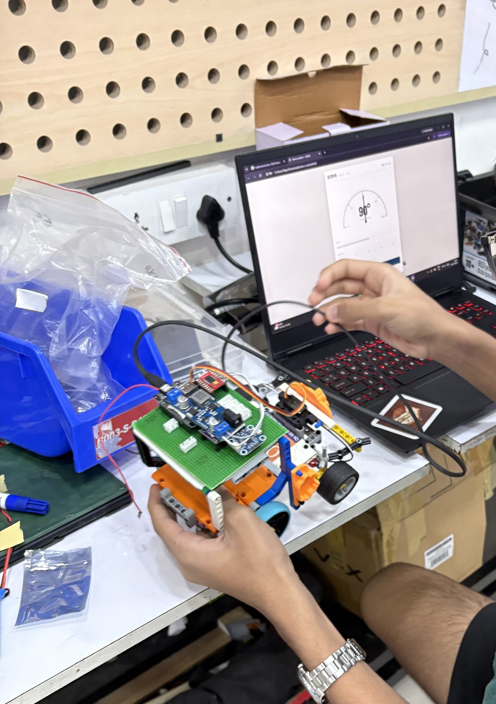
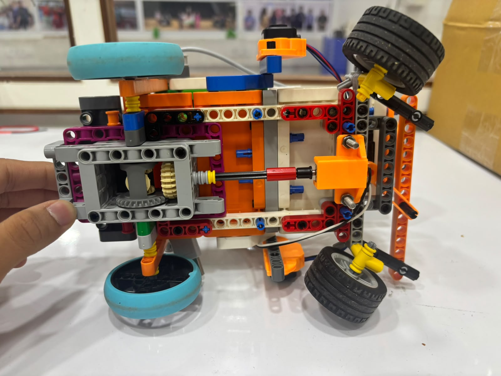

# 1 — Mobility & Mechanical Design

**Honest status: the vehicle is built to its Round-1 configuration — chassis,
single-servo Ackermann steering, and an N20 drive through a LEGO differential
are physically fitted, with all three TF-Lunas and the IMU mounted. The
Raspberry Pi 5 and camera are not yet on the vehicle. The gear-ratio, wheel and
battery specs are now read off the hardware and the vendor listing (2026-08-06,
tables below); the working point is still unmeasured, and the first sustained
drive exposed a wheel-retention failure (§3).** The critical-path gap (risk R10)
has narrowed from "no build" to "no measured working point", and this document
does not write around it.

---

## 1. What exists

### Steering — single-servo Ackermann

| Parameter | Value | Source |
|---|---|---|
| Steered axles | 1 (front) | WRO FE requires steered, not skid, steering |
| Actuator | Servo on `GPIO13` | `src/Round 1/round 1/round 1.ino` |
| Servo model | **MG90, metal gears** | read off hardware 2026-08-06 |
| Pulse range | 500-2400 us at 50 Hz | firmware |
| Angle range | 45-135 deg, 90 deg = straight | firmware, `constrain()` |
| Control law | proportional on heading error, `STEER_GAIN = 1.5` servo-deg per deg of error | firmware |
| Loop rate | ~50 Hz | firmware |

### A number that falls out of those two

`STEER_GAIN = 1.5` with a +/-45 deg travel limit means the steering **saturates at
30 degrees of heading error** (45 / 1.5). Beyond that the vehicle is at full lock
and the controller is open-loop until the error falls back under 30 deg.

That is intentional and it sets the corner behaviour: a 90 deg heading step at a
corner puts the controller into saturation immediately and holds full lock through
the first two thirds of the turn, which is the fastest legal way through it. It
also means `STEER_GAIN` cannot be tuned for corner response — corners are
saturated regardless — so the gain is free to be tuned purely for straight-line
stability.

### Why proportional only

No derivative term: the heading signal is differentiated on-chip already and a D
term on a 50 Hz loop amplifies quantisation into servo chatter.
No integral term: the target heading is a **step** function that jumps 90 deg at
every corner, and an integrator winds up across each step and then overshoots the
recovery. Steady-state heading error on a straight is bounded by servo resolution,
not by the absence of an I term.

### Drive — N20 via TB6612 (chosen 2026-08-01, integrated 2026-08-03)

| Parameter | Value | Source |
|---|---|---|
| Motor | **N20 (GA12-N20-600 class): 12 V rated, 600 RPM no-load, 1:50 gearbox; 0.18 kg-cm rated / 0.65 kg-cm stall torque; 0.06 A rated / 0.75 A stall** — datasheet-class figures, pending our own §6 measurement | vendor listing (robu.in), read 2026-08-06 |
| Transmission | spur pinion into a LEGO differential on the rear axle; external pinion:crown tooth ratio **uncounted** — the one number missing from the speed calculation | bottom view below |
| Driven axle / wheels | rear axle, both wheels through the differential; **rear 55.6 x 14 mm, front 41 x 21 mm** | measured 2026-08-06 |
| Battery | **3S Li-Po, 11.1 V nominal, 2600 mAh, DC-jack output** | read off pack 2026-08-06 |
| Driver | TB6612FNG, channel A | `src/Round 1/round 1/round 1.ino` |
| Pins | AIN1 `GPIO25` · AIN2 `GPIO26` · PWMA `GPIO33` · STBY `GPIO27` (or tied 3V3) | firmware |
| PWM | 20 kHz, 10-bit (0-1023), cruise duty 550 | firmware |
| Stop logic | an observer counts the 90-deg heading steps the corner logic makes; after 12 turns and heading settled within 15 deg (4 s failsafe), a 1500 ms timed run-on, then short-circuit brake | firmware |

Integration is append-only: the original steering / corner logic is
byte-untouched, and the module observes `targetHeading` steps rather than
modifying the trigger code. Physical bring-up — direction check, `MOTOR_INVERT`,
duty tune on the mat — is pending the build.

*Chassis prototype during steering bring-up — servo tester holding the 90-deg
centre position. Prototype hardware; the competition chassis configuration is
not yet frozen.*

*Underside of the built vehicle: the N20's pinion drives a LEGO differential on
the rear axle; the front Ackermann linkage and printed servo mount are at the
bottom of frame.*

---

## 2. What does not exist

| Item | State | Blocks |
|---|---|---|
| Drive motor + driver | **Chosen — N20 via TB6612**, integrated in firmware; specs on record above | Flash test + direction check + duty tune still pending |
| Chassis | **Built** — Lego Technic hybrid (plastic, printed PLA brackets for the sensors / servo / motor), Round-1 configuration; CAD/STLs not yet in `models/`; **rebuild to a fully 3D-printed chassis decided 2026-08-06** (driver: the wheel-retention failure, section 3) | Print + assemble the new frame; mass measurement, camera mounting |
| Gearing | **Partially closed** — integrated ratio 1:50 (datasheet); the external spur-pinion -> differential-crown tooth counts remain uncounted | The uncounted stage is the last unknown in the speed / torque working point |
| Wheels and tyres | **Measured** — rear 55.6 x 14 mm, front 41 x 21 mm | Traction limit; total mass still unmeasured |

`models/` is still empty because the CAD / STL sources for the printed parts
(sensor mounts, servo mount, motor mount) have not been collected yet — the
parts themselves are on the vehicle.

---

## 3. How the drivetrain will be chosen

The method was fixed before the motor family was chosen and still governs the
open part of the choice: the N20 + TB6612 pick constrains the space, but ratio,
wheels and speed remain to be derived. Writing it down first means the selection
can be criticised before money is spent.

### Hard bounds

| Bound | Value |
|---|---|
| Envelope | 300 x 200 x 300 mm |
| Mass | <= 1.5 kg total, including battery |
| Steering | Ackermann, single steered axle |

### Working point to be derived, in this order

1. **Target speed** from the run budget — three laps within the time limit, minus
   the time cost of the pass manoeuvres and the parking routine.
2. **Wheel diameter** -> required wheel RPM at that speed.
3. **Traction-limited torque** from mass and tyre-surface friction on the mat.
   This is the ceiling; torque above it spins the wheels and buys nothing.
4. **Motor + gear ratio** selected so the *continuous* operating point sits inside
   the motor's efficient band, not at its stall end. Stall torque is a
   specification, not an operating point.
5. **Current draw measured**, not summed from datasheets, and fed into
   [2 — Power & Sensors](2_power_and_sensors.md#6-power-budget).

**Where the derivation stands (2026-08-06):** at the pack's 11.1 V nominal the
no-load gearbox output is ~600 x (11.1 / 12) ≈ **555 RPM**; with 55.6 mm rear
wheels the theoretical no-load ceiling is `(555 / 60) x pi x 0.0556 / R_ext` ≈
**1.6 m/s / R_ext**, where `R_ext` is the uncounted pinion:crown ratio.
Counting two gears closes the calculation; a tape-measure speed run on the mat
replaces it with a measured number.

### The test that will change the design

Corner exit at full steering saturation is the binding mechanical case: it
combines maximum lateral load with the highest steering-rate demand. The
acceptance test is a repeated corner-exit run measuring understeer at the chosen
speed. If the vehicle cannot hold the post-corner line, the fix is mechanical —
weight distribution, tyre compound, or Ackermann geometry — not a gain change,
because the controller is saturated through that phase and gain has no authority
there.

This is written before the build so that the result cannot be rationalised
afterwards.

**First observed failure (2026-08-06), logged before any fix exists:** under
sustained drive the LEGO-mounted wheels shed from their axles within seconds.
Wheel retention is therefore the first mechanical acceptance gate — ahead of
the corner-exit test above, which cannot even be attempted until the wheels
stay on. The retention fix is **decided (2026-08-06): a full chassis rebuild to
a 3D-printed frame** with proper hubs and axle retention, replacing the LEGO
axle interface that sheds under load; when the printed chassis lands with a
before/after drive test, it becomes the drivetrain's first test-caused design
change - and puts committable CAD in `models/`.

**Superseded 2026-08-10: the rebuild is cancelled — this chassis is final.**
How retention was resolved on this frame is not recorded; what is on record is
that it now holds: the two 2026-08-09 Round-1 runs are 28 s and 29 s of
continuous driving with no wheel loss
([`other/test-runs-2026-08-09-round1/`](../other/test-runs-2026-08-09-round1/)),
roughly six times the failure duration observed on 2026-08-06. The
committable-CAD path narrows to the printed mounts already on the vehicle
(3x TF-Luna, servo, N20 — the `models/` gate); there is no chassis CAD because
there is no printed chassis. Residual gates: one full three-lap run, and the
wall-strike stall case.

**Impact path (answered 2026-08-06):** there is no sacrificial element and no
bumper — a hard wheel strike feeds force directly into the steering servo
(MG90, metal gears), and a head-on puts the chassis first against the wall.
Nothing has broken so far and no crash-driven design change exists yet;
whether a cheap fuse-part or bumper is worth its mass against the 1.5 kg
budget is an open trade.

---

## 4. Open

- **Wheel retention under drive torque — critical path** (observed failure, §3).
- The drivetrain working point: count the pinion:crown teeth, then measure
  speed and stall current on the mat. Motor, driver, wheels and pack are all
  now on record.
- Camera mount at ~100 mm height and 10-17 deg pitch has a geometric
  justification ([2 — Power & Sensors](2_power_and_sensors.md#3-camera-placement-justified-by-field-geometry))
  but no physical bracket; it depends on the chassis.
- CAD for `models/`. The signal-wiring schematic is now in `schemes/`; the
  power-tree schematic is unblocked (pack read 2026-08-06) and pending drawing.
- ~~Six vehicle photos for `v-photos/`~~ — **done 2026-08-05**, six views
  committed.
