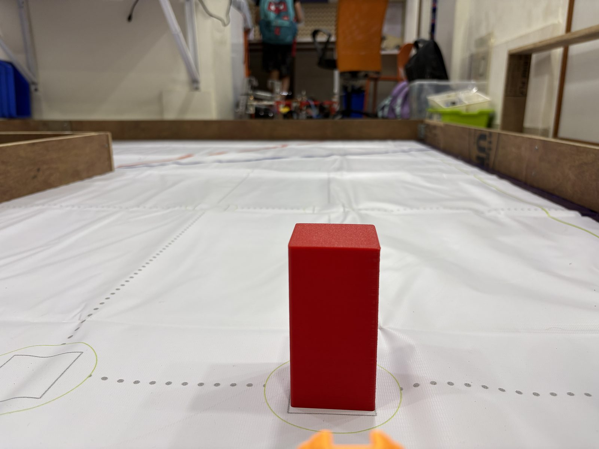
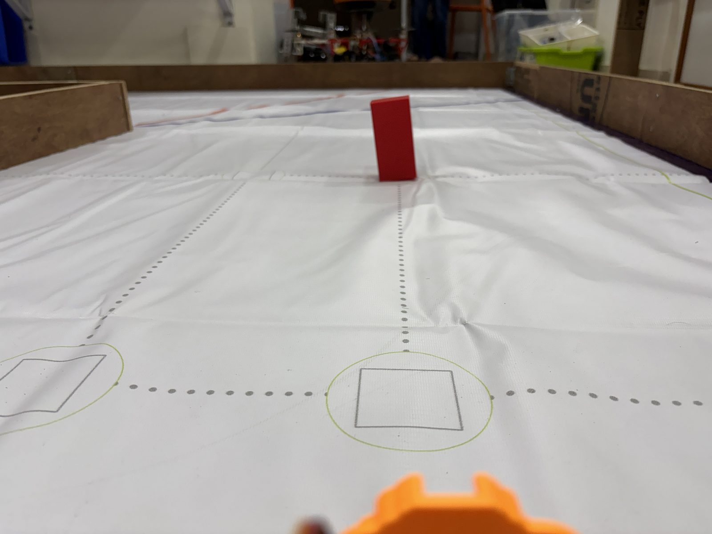
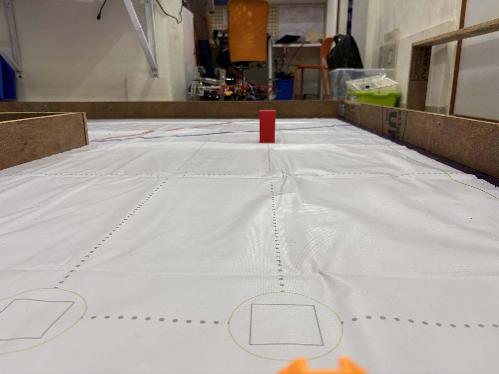

# 2 — Power & Sensor Architecture

---

## 1. Compute

| Board | Role | Why it is separate |
|---|---|---|
| **ESP32** | Sensing loop, heading hold, servo steering | Nominal ~50 Hz loop (20 ms delay; effective rate unmeasured — per-loop telemetry + I2C add cost). Must not be interrupted by a vision workload. |
| **Raspberry Pi 5** | Pillar detection, pass-side decision | CPU-only inference. Chosen over an accelerator because none is in budget; that constraint is what forced the model to be small enough to matter (see [4 — Systems Thinking](4_systems_and_decisions.md)). |

The two are deliberately not one board. A stalled detector must not stall the
steering loop — risk R7.

---

## 2. Sensors

| Sensor | Qty | Bus / pin | Measures | Chosen over |
|---|---|---|---|---|
| **BNO055** 9-DOF IMU | 1 | I2C `0x28`, mux ch4 | Absolute Euler yaw, 0-360 deg | MPU6050 — see below |
| **TF-Luna** LiDAR | 3 | I2C `0x10`, mux ch0/1/2 | Distance, left / centre / right | HC-SR04 — see below |
| **HC-SR04** ultrasonic | 3 | GPIO, interrupt-driven | Distance, front / left / right | *Retained as an alternative prototype, not the primary stack* |
| **Camera** | 1 | USB UVC webcam | Pillar colour and bearing | ~~Lenovo 300 FHD (identified 2026-08-06)~~ **OMO/WCAM/11 (team correction 2026-08-08, landed 2026-08-10)**; 30 fps ceiling until a CSI module is fitted |
| **PCA9548A** mux | 1 | I2C `0x70` | 8-channel I2C fan-out | Mandatory — see address collision below |

### Why absolute-heading IMU over gyro integration

`GetAngle_IMU.ino` is the retained MPU6050 read-out test. It was superseded by the
BNO055 because the Open Challenge runs three laps with **no landmark to correct
against**. An integrated turn rate accumulates drift monotonically over that
distance; the BNO055 fuses accelerometer, gyroscope and magnetometer on-chip and
returns an absolute yaw that does not.

### Why LiDAR over ultrasonic for corner detection

Corner detection is a **rising-edge** test on a side-looking range reading
(> 150 cm = the wall has given way). That makes beam width the deciding property,
not range accuracy:

| Property | TF-Luna | HC-SR04 |
|---|---|---|
| Beam width | ~2 deg | ~15 deg |
| Edge behaviour at a wall opening | Sharp transition | Smeared over several cm of travel |
| Reading rate | Fast, I2C register read | Limited by time-of-flight of sound; blocking unless interrupt-driven |
| Behaviour on an angled surface | Degrades gradually | Specular reflection away from the receiver, reads as "no wall" |

A 15 deg ultrasonic cone straddles the wall and the opening simultaneously for
several centimetres of travel, which turns a sharp edge into a ramp and makes the
edge-detection threshold speed-dependent. `triple_ultrasonic_sensor.ino` is kept
as a working non-blocking implementation in case a wide beam turns out to be
wanted for close-range obstacle presence, where a narrow beam can miss entirely.

### Address collision — why the multiplexer is not optional

All three TF-Luna units answer at I2C address `0x10` and the address is not
reconfigurable in the units held. They therefore cannot share a bus. The PCA9548A
at `0x70` places each on its own channel:

| Mux channel | Device |
|---|---|
| 0 | Left TF-Luna (`0x10`) |
| 1 | Centre TF-Luna (`0x10`) |
| 2 | Right TF-Luna (`0x10`) |
| 4 | BNO055 (`0x28`) |

The BNO055 has no address conflict and is behind the mux only for wiring
uniformity. **Bus:** `SDA = GPIO21`, `SCL = GPIO22`, 400 kHz.
**Servo:** signal on `GPIO13`, V+ from the external 5 V rail, ground common with
the ESP32.

---

## 3. Camera placement, justified by field geometry

The traffic signs are **50 x 50 x 100 mm**. Camera mounting height is set to
**~100 mm** — deliberately equal to the pillar height — with a downward pitch of
**10-17 deg**. Both numbers follow from the field, not from convenience.

### Look-ahead distance

With the camera at height `h` and pitched down by `alpha`, the optical axis meets
the floor at `Z = h / tan(alpha)`:

| Pitch | Optical axis meets floor at |
|---|---|
| 10 deg | 567 mm |
| 17 deg | 327 mm |

That band is the design target: far enough ahead that a pass decision can be
acted on before the pillar is under the bumper, close enough that the pillar
occupies enough pixels to classify. The exact pitch inside that band is a tuning
parameter, not a fixed value, and it is bounded by the 300 mm height envelope at
one end and by the pillar disappearing under the front of the vehicle at the
other.

### Why camera height equals pillar height

This is the load-bearing choice, and it is what makes the nearest-pillar
selection rule work.

With the lens at exactly pillar-top height, the **top** of every pillar projects
to approximately the horizon line **regardless of its distance**, while the
**base** projects progressively lower in the image as the pillar gets nearer.
Image-row of the base is therefore a monotonic proxy for range, with no
calibration and no depth sensor.

Two consequences follow directly:

1. **Nearest pillar = lowest box bottom edge.** This is the selection rule in
   `decide_nanodet.py`, and it is a geometric consequence of the mounting height,
   not a heuristic.
2. **It survives occlusion.** Clipping and occlusion eat the *top* of a pillar
   while its base stays put, so a range proxy built on the base degrades far more
   gracefully than one built on box height or box area.

Mounting materially lower would put pillar tops above the horizon, where they
silhouette against the far wall and the hue band picks up wall colour. Mounting
materially higher compresses the difference in base-row between near and far
pillars, which is exactly the signal the selection rule depends on.

*The mount-height argument, photographed from the camera position on the test
mat: the near pillar's base sits low in the frame, the far pillar's base sits
just under the horizon. Base row is the range proxy.*

**Resolved (2026-08-05): the fitted camera is a USB UVC webcam** (MJPEG,
640 x 480 @ 30 fps). ~~Identified 2026-08-06: Lenovo 300 FHD.~~ **Corrected
2026-08-10 to OMO/WCAM/11** — the team flagged the model on 2026-08-08 and the
docs lagged; the committed `docs/eval_raw/` JSON from the 08-08 measurement
retains the old name as a frozen artifact of that run. Consequence: the
high-frame-rate CSI capture path is gated on purchasing a CSI module, so 30 fps
is the current ceiling. Field of view — and therefore the pixel budget per
pillar at a given range — is pending a datasheet read verified against a
checkerboard measurement on our unit.

---

## 4. Calibration

### Colour

HSV bands are calibrated against the **official** sign colours published in the
game description rather than against sampled pixels from our own footage:

| Sign | RGB |
|---|---|
| Red pillar | 238, 39, 55 |
| Green pillar | 68, 214, 44 |
| Magenta parking wall | 255, 0, 255 |

Calibrating to published values rather than to captured ones means the bands do
not silently encode the lighting of the single session the dataset came from.
Magenta is included because it sits **between** red and green in hue and is the
most dangerous confuser on the field — it is mined into the detector's training
negatives for the same reason.

**Augmentation follows from this:** hue-jitter is disabled, because hue *is* the
class label. Value, saturation, gamma and synthetic cast shadows are used
instead — those are the properties venue lighting actually varies.

**Reversal (2026-08-05):** field testing showed fixed published-value bands
degrade under venue lighting variation, and the current stack calibrates **per
venue** by interactive sampling instead — one Lab chroma disc per colour. The
published RGB values remain the reference the sampled discs are sanity-checked
against. Reasoning:
[D6](4_systems_and_decisions.md#d6--neural-detector-superseded-in-the-field-calibrated-per-venue-picker-adopted).

### IMU

The BNO055 reports per-subsystem calibration status (0-3 for system, gyroscope,
accelerometer, magnetometer). Heading capture at `HEADING_LOCK` must gate on a
calibrated status rather than on a fixed startup delay.

---

## 5. Failure-point analysis

| Failure | Detection | Response |
|---|---|---|
| Mux channel select fails, wrong sensor read | Distance readings identical across channels | Not yet implemented — planned as a startup cross-check |
| TF-Luna returns a stale register | Value unchanged across N consecutive reads while the vehicle is moving | Not yet implemented — planned staleness counter per channel |
| BNO055 loses magnetometer calibration mid-run | Calibration status register drops | Not yet implemented — planned; degrade to last-good target heading rather than to a bad one |
| Detector process dies | No pass-side call arrives | **Handled by architecture** — steering continues on last heading target (R7) |
| Detector reports low confidence | Confidence below 0.45 | **Handled** — hold course, which is recoverable |
| Servo stall current drawn through the ESP32's 5 V chain (as wired: pack -> buck -> ESP32 -> servo) | ESP32 brownout / reset under steering load | Not yet implemented — planned dedicated servo rail; the §6 stall measurement sizes it |
| Pi 5 undervoltage — its 5 V / 5 A requirement fed from the shared 3S pack through a regulator of unconfirmed rating | Pi throttle flag / lightning-bolt, SD corruption risk | Not yet implemented — verify the regulator rating before any sustained run |

**Five of these seven are unimplemented and are named as such.** Per-sensor health
status is a known gap, not an oversight.

---

## 6. Power budget

**Not yet measured, and deliberately not estimated.**

**Pack read off the hardware (2026-08-06): 3S Li-Po, 11.1 V nominal, 2600 mAh,
DC-jack output.** The N20's spec is on record in
[1 — Mobility](1_mobility.md#drive--n20-via-tb6612-chosen-2026-08-01-integrated-2026-08-03)
(datasheet-class: 0.75 A stall). The blocking unknowns are gone: every row
below is measurable with a multimeter today.

Power tree as wired (2026-08-06): pack -> buck converter -> ESP32 -> servo —
the servo draws through the ESP32's 5 V chain, a named failure point in §5 —
and the Pi 5 runs from the **same pack** through a regulator whose rating is
unconfirmed against the Pi 5's 5 V / 5 A requirement. There is currently **no
main power switch, no start button, and no fuse** — and the first two are
**mandatory, not optional**: §9.6 requires the vehicle placed in the start zone
switched OFF, §9.10 allows exactly ONE switch to power it on, and §9.11
requires it to then WAIT for exactly ONE start button, pressed on the judge's
"Go" (§9.13–9.14). Current firmware auto-starts after boot, which violates the
waiting-state requirement — a wait-for-start-button state is needed in both
round programs, plus the physical switch and button. The fuse is good
practice rather than a rule; its rating follows from the stall currents
measured below.

What will be measured, per rail (the drivetrain now exists — nothing blocks this):

| Rail | Load | Measurement |
|---|---|---|
| 5 V | Raspberry Pi 5 under sustained inference | Inline current, averaged over a 15-minute run, captured in the same pass as the thermal measurement (R5) |
| 5 V | Servo, stall and steady-state | Inline current, stall figure taken separately |
| 5 V / 3.3 V | ESP32 + 3x TF-Luna + BNO055 + mux | Inline current, steady-state |
| Motor rail | Drive motor, stall and steady-state | Inline current |

Method: measured draw under load, not datasheet maxima summed. Datasheet sums
oversize the pack, and pack mass counts against the 1.5 kg limit.
