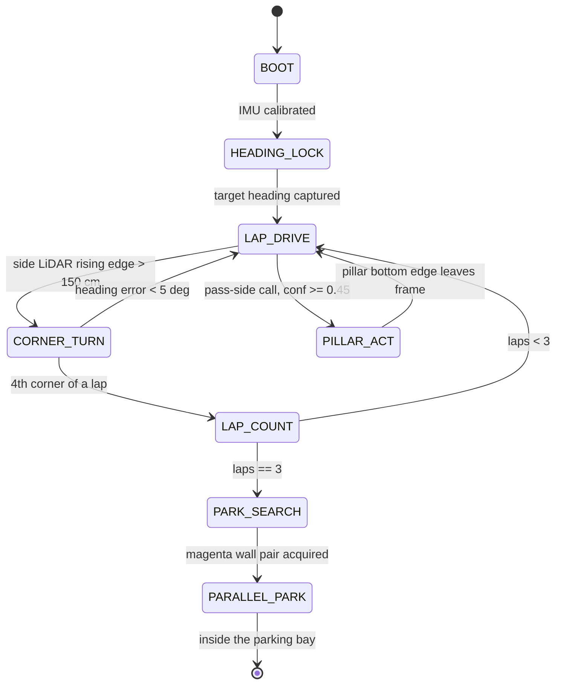

# 3 — Software Architecture & Obstacle Strategy

Two processors, one rule: **motion must never wait on perception.**

| Processor | Runs | Rate | Fails how |
|---|---|---|---|
| ESP32 | heading hold, corner detection, servo steering | ~50 Hz | If it stops, the vehicle stops |
| Raspberry Pi 5 | pillar detection, pass-side decision | vision-rate, unmeasured on Pi | If it stops, the vehicle keeps driving on its last heading target |

The split is deliberate. A detector stall on the Pi degrades the run to an Open
Challenge lap rather than ending it. Nothing in the steering loop blocks on a
vision result; the pass-side decision is an input the loop reads when present and
ignores when absent.

---

## 1. Open Challenge — implemented

`src/Round 1/round 1/round 1.ino`

1. On startup the current BNO055 Euler yaw is captured as the **target heading**.
2. `steerToHeading()` nulls the error between current and target heading, wrapped
   to +/-180 deg, and drives the servo proportionally: `STEER_GAIN = 1.5`
   servo-degrees per degree of heading error, clamped to 45-135 deg.
3. **Corner detection** is a rising-edge test, not a threshold test: a corner is
   declared when a side TF-Luna transitions from "wall present" to reading
   **> 150 cm** (`OPENING_CM`). The target heading is then stepped by 90 deg
   toward the opening.

**Why an edge and not a level.** A level test re-fires on every loop iteration
while the opening is still in view, stepping the heading by 90 deg repeatedly and
spinning the vehicle. The edge test fires once per opening.

**Why absolute heading rather than integrated turn rate.** The BNO055 supplies a
fused absolute yaw. A gyro-integrated heading accumulates drift over three laps
and there is no landmark in the Open Challenge to correct against.

---

## 2. Obstacle Challenge — implemented off-repo, pending landing

**Status: controller and Pi runtime are implemented and bench-tested off this
repository.** They land here after three integration fixes: the wireless
telemetry link is removed for rule 11.10 compliance, the BNO055 mux-channel map
is verified against the physical harness, and driver standby handling is
confirmed. Until they land, the state machine below is the specification of
record — written before the build so the reasoning could be criticised first.

### Why this shape

- **`LAP_DRIVE` is the default and every other state returns to it.** Any state
  that cannot make progress falls back to heading-hold, which is the behaviour
  that scores worst-case rather than crashes.
- **`PILLAR_ACT` is a lateral heading offset, not a separate controller.** The
  pass manoeuvre biases the same target heading the steering loop is already
  tracking. One controller, no handover, no second tuning problem.
- **No call is a state transition that does not happen.** A detector output below
  threshold leaves the machine in `LAP_DRIVE`. Holding course is the safe default;
  see the operating-point argument below.
- **`PILLAR_ACT` exits on the pillar bottom edge leaving frame, not on a timer.**
  A timer has to be tuned against a speed that is not yet chosen, because the
  drivetrain does not exist. The geometric exit condition survives that.

### Not yet specified

Parking-bay entry geometry, and the speed profile through `PILLAR_ACT` — both
blocked on the drivetrain (see [1 — Mobility](1_mobility.md), risk R10).

---

## 3. Detection stack

**Stack of record (2026-08-05): calibrated-Lab colour picker.** One (a,b) chroma
disc per colour in CIELab, sampled interactively at the venue (median + MAD sets
the tolerance, capped), with an L floor and a chroma gate; largest connected
component with extent and aspect gates; 3-of-5 temporal vote; nearest pillar by
lowest box bottom edge. Per-venue calibration is a deliberate reversal of the
fixed published-value-band philosophy — reasoning in
[D6](4_systems_and_decisions.md#d6--neural-detector-superseded-in-the-field-calibrated-per-venue-picker-adopted).
The runtime is implemented off-repo and lands with the Round 2 controller.

**Superseded (kept as evidence):** `nanodet_lite`, 1,167,660 parameters, 4.52 MB
ONNX — won the val split but did not transfer to real footage. Full write-up and
reproduction steps: [`src/Round 2/detector/README.md`](../src/Round%202/detector/README.md);
selection evidence vs `tiny_pillar`:
[4 — Systems Thinking](4_systems_and_decisions.md#d2--tiny_pillar-111-k-params-rejected-in-favour-of-nanodet_lite-117-m-params).

---

## 4. Metrics used to validate performance

All figures on the leakage-free group-wise validation split (124 real images).
They belong to the superseded neural stack and are retained as selection
evidence; the *method* — the sweep, asymmetric error costs, failure
decomposition — carries over to the current stack, whose own figures are the
next measurement.

### Confidence-threshold sweep

| thr | val acc | wrong side | no call | both-pillar wrong | false det / empty frame |
|---|---|---|---|---|---|
| 0.30 | 0.941 | 5.9 % | 0.0 % | 11.7 % | 0.350 |
| 0.35 | 0.932 | 5.9 % | 0.8 % | 13.3 % | 0.283 |
| **0.45** | **0.941** | **5.1 %** | 0.8 % | 18.3 % | **0.083** |
| 0.55 | 0.856 | **0.0 %** | 14.4 % | 20.0 % | 0.050 |

### Operating point: 0.45, and why

Chosen from the sweep, not by eye. Three reasons, in order:

1. **Joint-best on real-frame accuracy.** 0.30 and 0.45 tie at 0.941; nothing
   higher exists in the sweep.
2. **It cuts phantom detections on empty frames 3.4x versus 0.35** (0.083 vs
   0.283 per frame) and 4.2x versus 0.30. Most frames on a lap contain no pillar
   at all, so the empty-frame false-alarm rate is weighted more heavily than its
   column position suggests.
3. **Where it loses, it loses on synthetic data.** 0.45 is worse than 0.35 on the
   both-pillar column (18.3 % vs 13.3 %) — but that column is measured on
   **composited** frames, while the columns it wins on are measured on real ones.
   A real measurement outranks a synthetic one.

**When we would move it.** `thr 0.55` gives **zero** wrong-side calls on real
frames, at the cost of holding course 14.4 % of the time. If venue testing shows
that a spurious steer is more expensive than hesitation — for instance if the
vehicle cannot recover its line after a wrong pass — 0.55 is the switch, and it
is a one-line change.

### Failure decomposition

Where the remaining error actually lives:

| Stage | Share |
|---|---|
| Detection — nearest pillar never proposed | **30.0 %** |
| Selection — wrong pillar chosen as nearest | 1.7 % |
| Classification — right pillar, wrong colour | **0.0 %** |

This decomposition is what killed the HSV-rescoring proposal
([D3](4_systems_and_decisions.md#d3--hsv-confidence-rescoring-researched-quantified-rejected)):
colour is already solved, so a colour-based fix has nowhere to go.

---

## 5. Edge cases

| Case | Handling |
|---|---|
| **Magenta parking walls** sit between red and green in hue and defeat a naive hue band | Magenta surfaces mined into the training negatives. HSV bands calibrated against the official RGB values (red 238,39,55 · green 68,214,44 · magenta 255,0,255). |
| **Two same-colour pillars merge into one blob** under connected components | Nearest pillar is selected by **lowest box bottom edge**, which survives a merge better than box area or height. |
| **Distant pillars** below the `MIN_H` height gate | Deliberately ignored. A pillar too small to measure reliably is a pillar there is still time to react to on a later frame. |
| **Occluded pillar, top clipped** | Selection uses the bottom edge, not the height: clipping eats the top of a pillar while its base stays put. |
| **Both pillars in frame** | Normal on track. Nearest-by-bottom-edge decides. Worst-measured condition — see the sweep. |
| **No detection above threshold** | Hold course. Recoverable; a wrong steer is not. |
| **Mixed 4:3 and 16:9 source images** | Letterboxed, never stretched — stretching would let the model infer class from aspect ratio. |
| **Class list reordered in a config** | Pass-side lookup keyed on class **name**, not index. Loader refuses to start on a mismatch. |

---

## 6. Programming strategy history

Kept separate from mechanical history deliberately — they iterate on different
clocks and for different reasons.

| Version | What it was | Why it changed |
|---|---|---|
| HSV v1 | Hue-band threshold + contours + morphological opening | Opening dominated connected-components cost |
| HSV v4.1 | Dual classifier with startup auto-select, opening removed | 0.43 ms/frame; still the fastest thing measured |
| `tiny_pillar` | 111 K-param detector written from scratch | Abstains 9.7 % of the time; caution is not accuracy |
| `nanodet_lite` | NanoDet-Plus stripped to 45 files, no Lightning/yacs/omegaconf/pycocotools | Won the val split (six of seven metrics); **did not transfer to real footage** — single-session, zero-clutter data. Superseded 2026-08-05. |
| HSV rescoring | Proposed confidence re-weighting | Rejected on a ceiling calculation of <= 1 point |
| ROI + CNN verifier | Proposed fallback architecture | Voided: a verifier cannot recover a miss |
| YOLO26 (Ultralytics) | 9.47 M-param end-to-end detector; `s` measured ~30 fps @ 224 on the Pi 5 | Trained on the leaky split (numbers withdrawn); the smaller `n` variant failed under concurrent runtime load — suspected OOM, kernel-log capture pending |
| Calibrated-Lab picker | Per-venue interactive calibration: one (a,b) chroma disc per colour + L floor; CCL; 3-of-5 vote | **Current.** Fixed bands degraded under lighting / brightness variation; per-venue sampling is the reversal that survived. Sub-iterations (3-disc brightness buckets, capsule chain) tested and killed — the single disc is what passed hardware testing. Accuracy and ms/frame capture pending |

Full reasoning for each in [4 — Systems Thinking & Engineering Decisions](4_systems_and_decisions.md).
