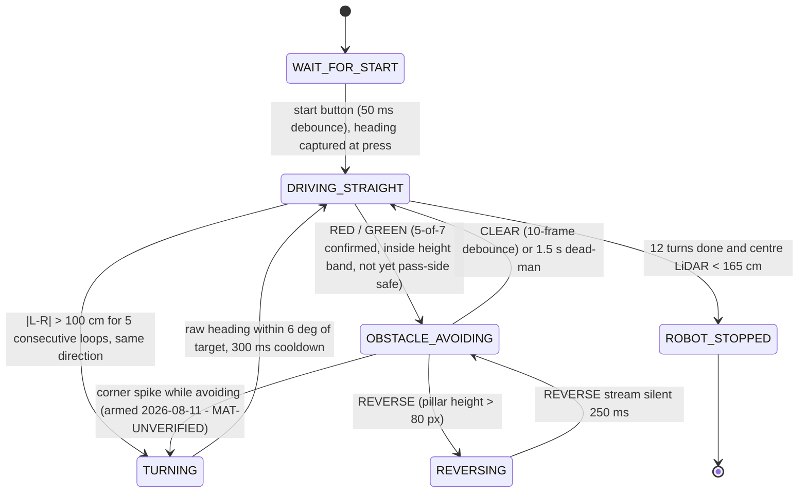
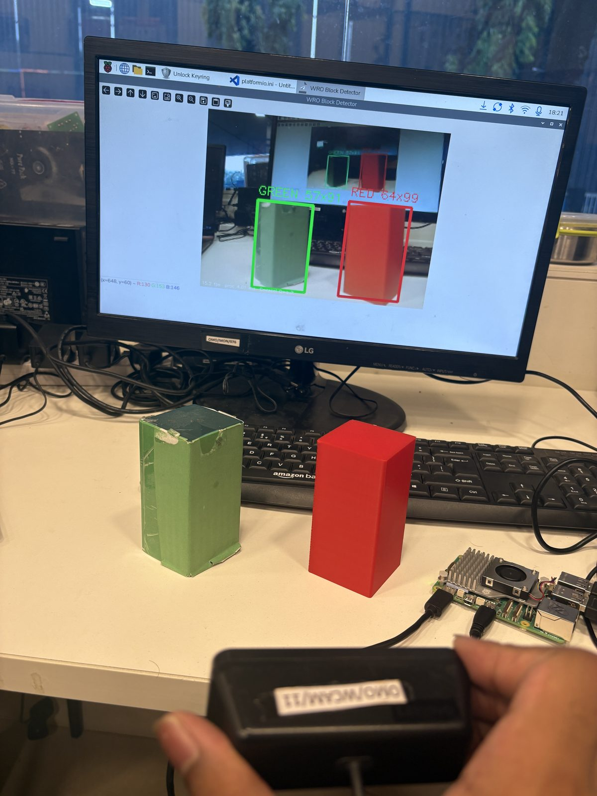
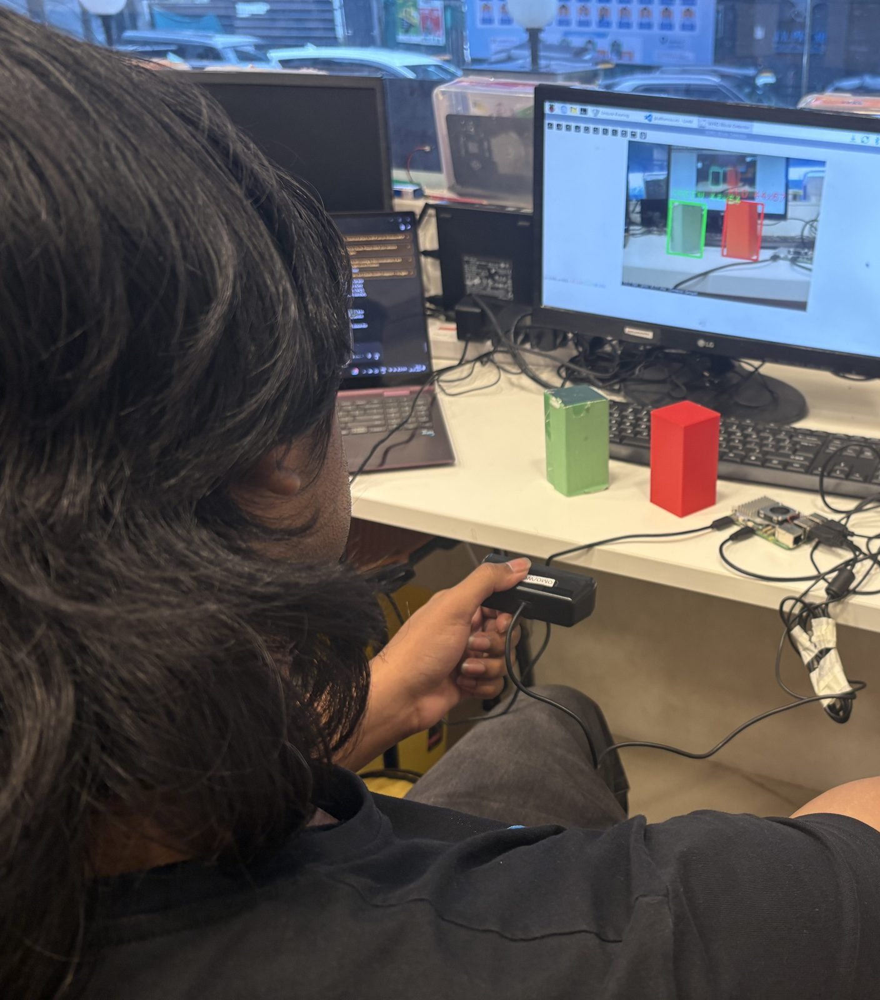

# 3 — Software Architecture & Obstacle Strategy

Two processors, one rule: **motion must never wait on perception.**

| Processor | Runs | Rate | Fails how |
|---|---|---|---|
| ESP32 | heading hold, corner detection, servo steering | ~50 Hz nominal (unmeasured) | If it stops, the vehicle stops |
| Raspberry Pi 5 | pillar detection, pass-side decision | vision-rate, unmeasured on Pi | If it stops, the vehicle keeps driving on its last heading target |

The split is deliberate. A detector stall on the Pi degrades the run to an Open
Challenge lap rather than ending it. Nothing in the steering loop blocks on a
vision result; the pass-side decision is an input the loop reads when present and
ignores when absent.

---

## 1. Open Challenge — implemented

`src/Round 1/round 1/round 1.ino`

1. On startup the current BNO055 Euler yaw is captured as the **target heading**.
2. `steerToHeading()` nulls the error between current and target heading, wrapped
   to +/-180 deg, and drives the servo proportionally: `STEER_GAIN = 1.0`
   servo-degree per degree of heading error with a 2.0 deg deadband, clamped to
   the asymmetric 64-136 window about the 106 centre (retuned 2026-08-10,
   `58adb1c`; was 1.5 gain / 45-135).
3. **Corner detection** is a rising-edge test, not a threshold test: a corner is
   declared when a side TF-Luna transitions from "wall present" to reading
   **> 150 cm** (`OPENING_CM`). The target heading is then stepped by 90 deg
   toward the opening.

**Why an edge and not a level.** A level test re-fires on every loop iteration
while the opening is still in view, stepping the heading by 90 deg repeatedly and
spinning the vehicle. The edge test fires once per opening.

**Why absolute heading rather than integrated turn rate.** The BNO055 supplies a
fused absolute yaw. A gyro-integrated heading accumulates drift over three laps
and there is no landmark in the Open Challenge to correct against.

---

## 2. Obstacle Challenge — implemented

**Status: landed.** Controller (`src/Round 2/main.cpp`) and Pi runtime
(`src/Round 2/round2.py`) are in this repository. The three integration fixes
that gated the landing are done: the wireless telemetry link is compiled out
behind `ENABLE_BLUETOOTH 0` for rule 11.10 compliance, the BNO055 sits on
verified multiplexer channel 4, and the TB6612 standby line is driven high
unconditionally. The state machine below documents the controller as flashed.

### The serial protocol, and why it is state-gated

The Pi speaks five messages at 115200 baud: `RED`, `GREEN`, `CLEAR`, `REVERSE`,
and `POS,cx,h` (Kalman-smoothed pillar centre-x and height, every tracked
frame). The active colour is re-sent every 0.5 s as a keepalive; the controller
auto-clears after 1.5 s of silence, so a dead link degrades to heading-hold
instead of a runaway swerve.

Commands are honoured only where they are safe. `RED`/`GREEN` are accepted
while driving straight **or already avoiding** — a mid-avoid colour switch must
flip the swerve, a failure we hit in testing. Everything is ignored during
`TURNING` (a corner is never aborted halfway) and after `ROBOT_STOPPED` (a
stray post-finish detection must never restart the vehicle, rule 9.24).

### Why this shape

- **`DRIVING_STRAIGHT` is the default and every other state returns to it.**
  Any state that cannot make progress falls back to PD heading-hold, which is
  the behaviour that scores worst-case rather than crashes.
- **Avoidance is a gradient, with the field-proven full lock as its boundary.**
  The steer offset is proportional to how far the pillar sits from its
  pass-side safe line in the frame (`offset = KV * error`, floored at a small
  minimum while error remains, clamped to the +/-35 mechanical envelope). Large
  error saturates to exactly the old binary full-lock swerve, which also
  remains the fallback until the first `POS` of each pillar arrives. Field
  evidence is never thrown away — it becomes the clamp.
- **Detection is gated by voting, not by a confidence score.** The calibrated-Lab
  picker has no confidence scalar; a colour must appear in 5 of the last 7
  frames, inside the height band, and short of its pass-side line before a
  command is sent. Holding course remains the safe default.
- **Heading is captured at the start button, not at boot** — with the vehicle
  placed on the mat, so the reference frame is the field. The BNO055 runs in
  IMUPLUS mode (no magnetometer: drive-motor magnets cannot distort yaw), and
  each turn target is stepped +/-90 deg **from the previous target**, so the
  four leg headings stay exactly orthogonal in any reference frame and drift
  cannot accumulate across twelve turns.
- **Corner spikes must persist.** A pillar occluding one side LiDAR can fake the
  left-right asymmetry for a frame or two; requiring 5 consecutive
  same-direction loops rejects it. Turn completion is checked on the raw
  heading — the smoothing filter's ~200 ms lag would overshoot every corner.

### Designed, not yet implemented

**Parking is confirmed in-scope (decided 2026-08-06)** — `PARK_SEARCH` /
`PARALLEL_PARK` states are a commitment, not an option, but they are not in
the flashed controller yet. The scoring
table settles it: rule 1.8.3 pays 7 points even for a partial or non-parallel
park, so a crude, conservative attempt strictly dominates a descope (full
rationale: [4 — Decisions](4_systems_and_decisions.md), D7). Two constraints
shape the implementation: the runtime colour picker **excludes magenta by
design** — its tight Lab tolerance is exactly what makes red-vs-magenta
confusion structurally impossible — so bay detection needs either a third
calibrated magenta class or TF-Luna geometry against the 20 mm limiters; and
rule 9.24.7 ends the round on touching a limiter, which caps how aggressive
the manoeuvre may be.

Parking-bay entry geometry, and the tuned value of the gradient gain `KV` —
both wait on the new chassis dimensions and mat time (see
[1 — Mobility](1_mobility.md)).

---

## 3. Detection stack

**Stack of record (2026-08-05): calibrated-Lab colour picker.** One (a,b) chroma
disc per colour in CIELab, sampled interactively at the venue (median + MAD sets
the tolerance, capped), with an L floor and a chroma gate; largest connected
component with extent and aspect gates; 5-of-7 temporal vote; nearest pillar by
lowest box bottom edge. Per-venue calibration is a deliberate reversal of the
fixed published-value-band philosophy — reasoning in
[D6](4_systems_and_decisions.md#d6--neural-detector-superseded-in-the-field-calibrated-per-venue-picker-adopted).
The runtime is landed at `src/Round 2/round2.py` alongside the controller.

*Bench test on the Raspberry Pi 5 against physical pillars: dual-pillar frame
classified with per-colour boxes. The overlay's fps and per-frame-ms figures
will be quoted in the metrics section once pinned to the exact build under
test.*

**Superseded (kept as evidence):** `nanodet_lite`, 1,167,660 parameters, 4.52 MB
ONNX — won the val split but did not transfer to real footage. Full write-up and
reproduction steps: [`src/Round 2/detector/README.md`](../src/Round%202/detector/README.md);
selection evidence vs `tiny_pillar`:
[4 — Systems Thinking](4_systems_and_decisions.md#d2--tiny_pillar-111-k-params-rejected-in-favour-of-nanodet_lite-117-m-params).

---

## 4. Metrics used to validate performance

All figures on the leakage-free group-wise validation split (124 real images).
They belong to the superseded neural stack and are retained as selection
evidence; the *method* — the sweep, asymmetric error costs, failure
decomposition — carries over to the current stack, whose own figures are in
§4.1 below. Raw output for every table in this document is committed under
`docs/eval_raw/`.

### 4.1 The picker's own figures (current stack of record)

Measured 2026-08-08 by `src/Round 2/eval_picker.py`, which imports the detection
functions from `round2.py` **verbatim** — no reimplementation, so what is
measured is the code that runs on the robot. Calibration is fitted with the
shipped `calibrate_color()` on the **train** split only; the val images below
were never used to fit it. Raw: `docs/eval_raw/picker_eval_summary.txt`.

| | pooled calibration | condition-matched calibration |
|---|---|---|
| Detection rate (nearest pillar) | 68.5 % | 63.3 % stills · 100 % video |
| Colour correct, given a detection | 76.5 % | **90.3 %** stills · 80.8 % video |
| Pass-side calls committed | 33.1 % (41/124) | 33.7 % stills · 38.5 % video |
| **Accuracy among committed calls** | 90.2 % (37/41) | **100 % (33/33)** stills · 90.0 % (9/10) video |
| **Wrong-side rate** | 3.2 % | **0.0 %** stills · 3.8 % video |
| Hold course (pillar under the 45 px gate) | 50.8 % | 50.0 % · 23.1 % |
| False detections per empty frame | 0.35 (21/60) | — |
| Latency, 240×240 | 4.6 ms median (desktop, **not a Pi figure**) | — |

**The finding, and it changed race procedure.** Pooling calibration samples
across two acquisition sessions drives red's tolerance to exactly 15.00 — the
`max_tol` ceiling — because the two sessions disagree about what red *is*: their
fitted red centres sit **24.0 apart** in Lab (a,b) (stills a=29.9 b=23.5; video
a=48.5 b=38.7) while the tolerance is only 12–15. One circle cannot cover both,
so the pooled fit lands between them and clips both. Calibrating within a single
condition removes the wrong-side calls entirely on the stills family (0 wrong in
33 committed calls) and lifts colour accuracy 76.5 % → 90.3 %.

This is the measured form of the field failure we recorded on 2026-08-06
("detector fails on slight colour shift"). It is not a defect to be tuned away —
it is a property of thresholding raw colour, and the procedural answer is to
calibrate **at the venue, in the venue's light**, and never reuse a calibration
across lighting. That is what `--calib` JSON persistence exists for: calibrate
once during check time, then run headless from the saved file.

**Honest limits of this table.** The dataset was shot on a different camera than
the robot's, so these numbers validate the *method*, not venue performance.
Still images cannot exercise the 5-of-7 temporal vote, so the false-alarm figure
is per-frame and is therefore an upper bound on what the runtime does. The
co-occurrence arm is the weakest result — 47.1 % among committed calls (8 right,
9 wrong out of 60 composited frames), i.e. a coin flip when two pillars are
visible; those frames are composited rather than photographed, but the direction
matches the known dominant failure and it is why the mid-avoid colour-switch fix
was made a blocker rather than a nicety. Set against that,
[`other/bench-2026-08-05/bench-5.jpeg`](../other/bench-2026-08-05/bench-5.jpeg)
shows the runtime resolving a real red and a real green pillar simultaneously and
correctly on the deployed camera — one frame, so it settles nothing, but it is
reason to treat the composited proxy as pessimistic and to re-measure against
real two-pillar footage.

**Two limits this measurement exposed, both now on the record.** The 4.6 ms is
the hand-rolled NumPy Lab conversion in `round2.py`; `pillar_fast.py` does the
same conversion through `cv2.cvtColor` in 0.43 ms. On Pi-class hardware that
difference decides whether the loop clears 30 fps, and it is the first
optimisation to make if the field run is frame-starved. Second, 50.8 % of val
frames sit below the 45 px swerve gate — the gate is doing most of the work in
this dataset, so the detection numbers above describe a harder regime than the
close-range decisions that actually score.

### Confidence-threshold sweep

Superseded stack. Raw: `docs/eval_raw/nanodet_sweep_raw.txt`.

| thr | val acc | wrong side | no call | both-pillar wrong | false det / empty frame |
|---|---|---|---|---|---|
| 0.30 | 0.941 | 5.9 % | 0.0 % | 11.7 % | 0.350 |
| 0.35 | 0.932 | 5.9 % | 0.8 % | 13.3 % | 0.283 |
| **0.45** | **0.941** | **5.1 %** | 0.8 % | 18.3 % | **0.083** |
| 0.55 | 0.856 | **0.0 %** | 14.4 % | 20.0 % | 0.050 |

### Operating point: 0.45, and why

Chosen from the sweep, not by eye. Three reasons, in order:

1. **Joint-best on real-frame accuracy.** 0.30 and 0.45 tie at 0.941; nothing
   higher exists in the sweep.
2. **It cuts phantom detections on empty frames 3.4x versus 0.35** (0.083 vs
   0.283 per frame) and 4.2x versus 0.30. Most frames on a lap contain no pillar
   at all, so the empty-frame false-alarm rate is weighted more heavily than its
   column position suggests.
3. **Where it loses, it loses on synthetic data.** 0.45 is worse than 0.35 on the
   both-pillar column (18.3 % vs 13.3 %) — but that column is measured on
   **composited** frames, while the columns it wins on are measured on real ones.
   A real measurement outranks a synthetic one.

**When we would move it.** `thr 0.55` gives **zero** wrong-side calls on real
frames, at the cost of holding course 14.4 % of the time. If venue testing shows
that a spurious steer is more expensive than hesitation — for instance if the
vehicle cannot recover its line after a wrong pass — 0.55 is the switch, and it
is a one-line change.

### Failure decomposition

Where the remaining error actually lives:

| Stage | Share |
|---|---|
| Detection — nearest pillar never proposed | **30.0 %** |
| Selection — wrong pillar chosen as nearest | 1.7 % |
| Classification — right pillar, wrong colour | **0.0 %** |

This decomposition is what killed the HSV-rescoring proposal
([D3](4_systems_and_decisions.md#d3--hsv-confidence-rescoring-researched-quantified-rejected)):
colour is already solved, so a colour-based fix has nowhere to go.

---

## 5. Edge cases

| Case | Handling |
|---|---|
| **Magenta parking walls** sit between red and green in hue and defeat a naive hue band | Magenta surfaces mined into the training negatives. HSV bands calibrated against the official RGB values (red 238,39,55 · green 68,214,44 · magenta 255,0,255). |
| **Two same-colour pillars merge into one blob** under connected components | Nearest pillar is selected by **lowest box bottom edge**, which survives a merge better than box area or height. |
| **Distant pillars** below the `MIN_H` height gate | Deliberately ignored. A pillar too small to measure reliably is a pillar there is still time to react to on a later frame. |
| **Occluded pillar, top clipped** | Selection uses the bottom edge, not the height: clipping eats the top of a pillar while its base stays put. |
| **Both pillars in frame** | Normal on track. Nearest-by-bottom-edge decides. Worst-measured condition — see the sweep. |
| **No detection above threshold** | Hold course. Recoverable; a wrong steer is not. |
| **Mixed 4:3 and 16:9 source images** | Letterboxed, never stretched — stretching would let the model infer class from aspect ratio. |
| **Class list reordered in a config** | Pass-side lookup keyed on class **name**, not index. Loader refuses to start on a mismatch. |

---

## 6. Programming strategy history

Kept separate from mechanical history deliberately — they iterate on different
clocks and for different reasons.

| Version | What it was | Why it changed |
|---|---|---|
| HSV v1 | Hue-band threshold + contours + morphological opening | Opening dominated connected-components cost |
| HSV v4.1 | Dual classifier with startup auto-select, opening removed | 0.43 ms/frame; still the fastest thing measured |
| `tiny_pillar` | 111 K-param detector written from scratch | Abstains 9.7 % of the time; caution is not accuracy |
| `nanodet_lite` | NanoDet-Plus stripped to 45 files, no Lightning/yacs/omegaconf/pycocotools | Won the val split (six of seven metrics); **did not transfer to real footage** — single-session, zero-clutter data. Superseded 2026-08-05. |
| HSV rescoring | Proposed confidence re-weighting | Rejected on a ceiling calculation of <= 1 point |
| ROI + CNN verifier | Proposed fallback architecture | Voided: a verifier cannot recover a miss |
| YOLO26 (Ultralytics) | 9.47 M-param end-to-end detector; `s` measured ~30 fps @ 224 on the Pi 5 | Trained on the leaky split (numbers withdrawn); the smaller `n` variant failed under concurrent runtime load — suspected OOM, kernel-log capture pending |
| Calibrated-Lab picker | Per-venue interactive calibration: one (a,b) chroma disc per colour + L floor; CCL; 3-of-5 vote | **Current.** Fixed bands degraded under lighting / brightness variation; per-venue sampling is the reversal that survived. Sub-iterations (3-disc brightness buckets, capsule chain) tested and killed — the single disc is what passed hardware testing. Accuracy and ms/frame capture pending |

Full reasoning for each in [4 — Systems Thinking & Engineering Decisions](4_systems_and_decisions.md).
