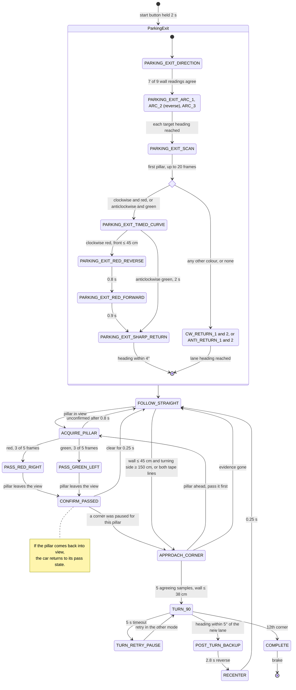
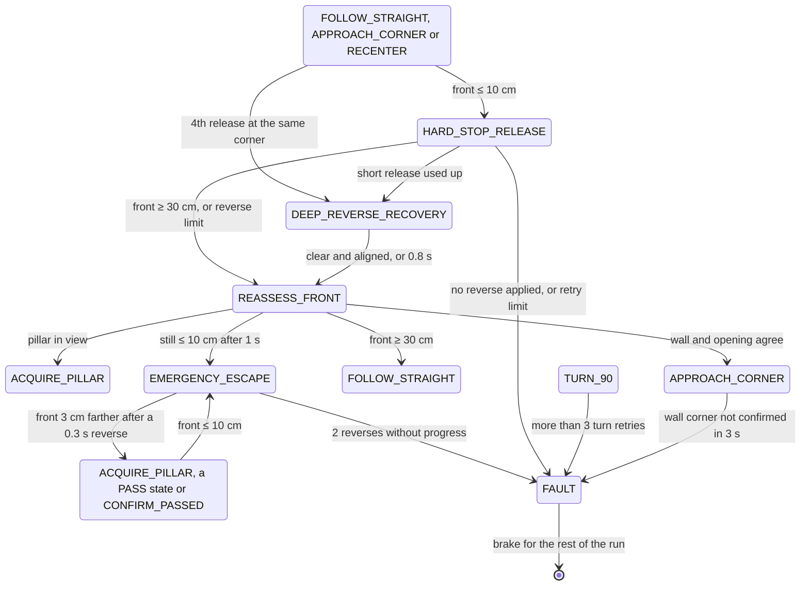

# APAC 2026 software — Obstacle Challenge state machine

**Scope.** How [`src/apac-2026/obstacle-challenge/main.py`](../src/apac-2026/obstacle-challenge/main.py) drives the Obstacle Challenge, as committed in v0.4.0. Names in capitals are the controller's states; names in `code` are constants in `main.py`, given with their values. The Nationals software is in [3 — Software](3_software.md) and the vehicle in [APAC 2026 vehicle](apac_2026_vehicle.md).

## 1. The control loop

In a loop that sleeps 10 ms between passes (`NAVIGATION_LOOP_SECONDS`), the Raspberry Pi:

1. reads the newest ESP32 telemetry line: heading, the left, centre and right TF-Luna distances, and a validity mask;
2. takes the newest camera frame and runs the pillar and tape-line detector (`UnifiedPillarDetector`);
3. calls the controller (`ObstacleChallengeController.update`), which sends one `speed,direction,steer` command to the ESP32.

The run starts once the start button has been held for 2 s: the ESP32 then sends `OK` and the Pi answers `OK`. It ends in COMPLETE after 12 corners (`COUNTER_MAX`), that is three laps. Parking exit is on (`ENABLE_PARKING_EXIT = True`); parking at the end is off (`ENABLE_PARKING_IN = False`). Every state change is printed as `[NAV] OLD -> NEW: reason`.

## 2. The run

- Red pillars are passed on the right and green ones on the left.
- From any pillar state, a pillar seen beyond both tape lines within 5 s of a pass (`ALPHA_POSITION_WINDOW_SECONDS`) belongs to the next straight, so the car goes to APPROACH_CORNER and takes the corner first.
- Every driving state brakes and holds while the telemetry is older than 0.30 s (`TELEMETRY_STALE_SECONDS`), a TF-Luna or the heading is invalid, or the camera frame is older than 0.30 s (`CAMERA_STALE_SECONDS`). It resumes in the same state, and the hold does not count against that state's timers.

## 3. Recovery and faults

EMERGENCY_ESCAPE resumes whichever state it interrupted. The parking-exit states also go to FAULT when a timed step overruns (4 s to reach the first red pillar, 5 s to reach the lane heading).

## 4. Why the states are split this way

| State | Reason |
|---|---|
| PARKING_EXIT_DIRECTION | The lane direction must be known before the first corner. The code takes it from which side wall is nearer: 7 of the last 9 readings must agree, each with left and right at least 15 cm apart (`DIRECTION_MIN_DIFFERENCE_CM`). |
| PARKING_EXIT_SCAN | A pillar may stand just outside the parking lot. If it is on the side the car turns toward (red when driving clockwise, green anticlockwise), a timed pass keeps the car on its correct side; otherwise two heading arcs return the car to its lane. |
| ACQUIRE_PILLAR | One frame of red or green must not steer the car, so a pillar is followed only once 3 of 5 frames confirm it. |
| CONFIRM_PASSED | The camera loses a pillar before the rear of the car has cleared it, so the car holds its line for 0.25 s (`PILLAR_CLEARANCE_HOLD_SECONDS`). |
| APPROACH_CORNER | Neither a tape line nor a short front distance alone proves a corner. A turn needs the end wall within 38 cm (`CORNER_TRIGGER_CM`), the side the car turns toward open to at least 150 cm (`OBSTACLE_CORNER_SIDE_OPEN_CM`) and the heading within 8° of the straight, in 5 agreeing samples over at least 0.30 s. |
| TURN_90 | The target is the straight's heading plus or minus 90°, reached within 5° (`TURN_HEADING_TOLERANCE`). When the outer side has at least 60 cm of room (`CORNER_REVERSE_CLEARANCE_CM`), the turn starts with a reverse arc of up to 0.8 s; otherwise it is driven forward. |
| POST_TURN_BACKUP | After each corner the car reverses for 2.8 s (`POST_TURN_BACKUP_SECONDS`) so that the next straight and its pillars fit in the camera's view. |

## 5. Edge cases the code handles

| Situation | What happens |
|---|---|
| Telemetry or camera stale, or a sensor invalid | Brake and hold the current state; resume when fresh. |
| The same pillar seen again just after a pass | Ignored for 0.6 s (`PILLAR_REACQUIRE_COOLDOWN_SECONDS`). |
| Candidate pillar not confirmed | Back to FOLLOW_STRAIGHT after 0.8 s (`PILLAR_ACQUIRE_TIMEOUT_SECONDS`). |
| Pillar ahead during a corner approach | The corner is paused, the pillar is passed, then the corner approach resumes. |
| Pillar beyond the corner seen right after a pass | The corner is taken first (§2). |
| Front within 10 cm | A short reverse, then a fresh check for a pillar, a corner or a clear front before moving on (§3). |
| Repeated releases at one corner | After the third, a longer reverse at speed 55 for up to 0.8 s, aiming for 70 cm of clearance. |
| Turn not finished in 5 s | Retry with the other turn mode (forward or reverse), up to 3 retries. |
| 12th corner | COMPLETE: the car brakes and stays stopped. |

## 6. Known limits

- The driving direction is locked at the start and does not change during the run.
- The last-resort front trigger (`PYTHON_EMERGENCY_RELEASE_CM = 10`) is inside the TF-Luna's blind zone: its specified range starts at 0.2 m (vendor). Corners are normally handled from 45 cm, so this trigger only acts after a misjudgement.
- Since the firmware stop was removed on 2026-09-10, the ESP32 always reports `hardStop = 0`, so the `hard_stop` checks in `main.py` never fire; some comments in `main.py` still describe an ESP32 stop at 18 cm.
- With parking at the end off, PARKING_ENTRY_SEARCH and the PARKING_IN_ states are never reached. No transition leads into the PARKING_EXIT_CW_RED_ and PARKING_EXIT_ANTI_GREEN_ states.
- FAULT stops the car for the rest of the run.

## 7. Validation

Not in the repository yet: run logs. A run started as `python main.py 2>&1 | tee run_N.log` records every transition with its reason, which gives corners completed, pillars passed, recoveries and faults per run.
