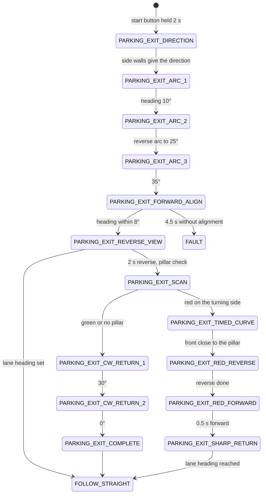
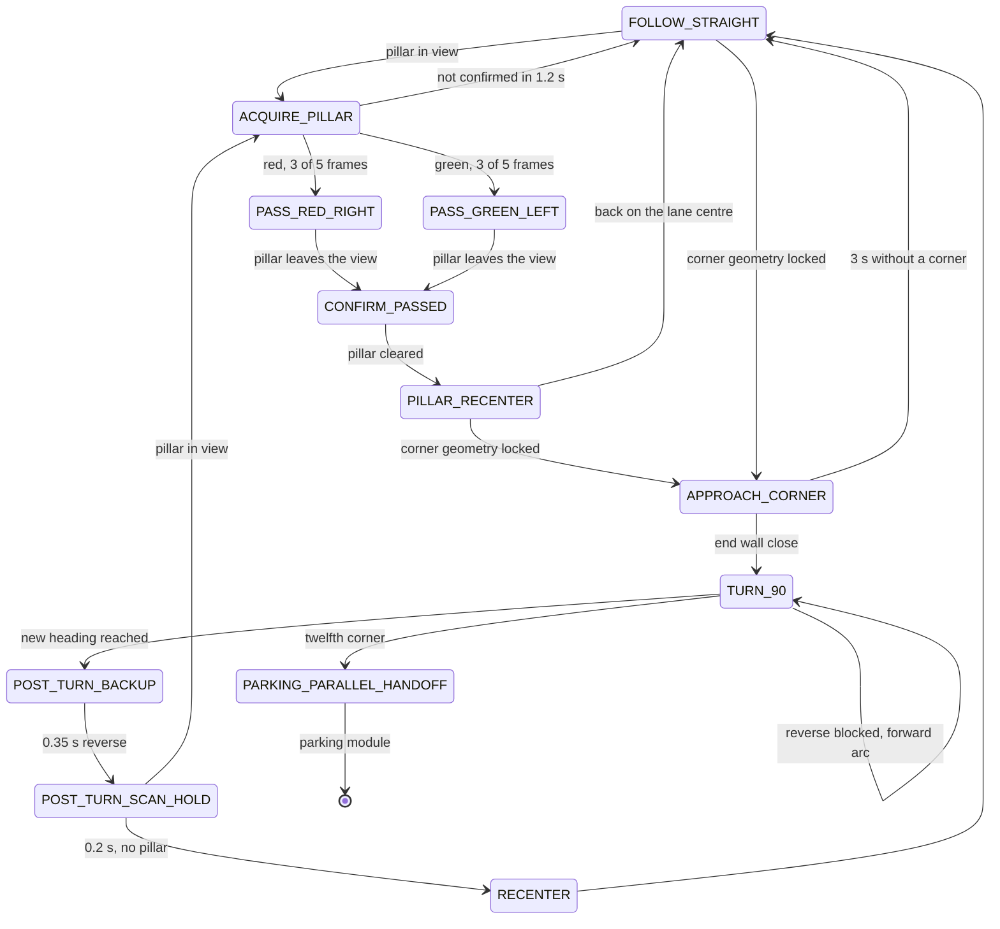
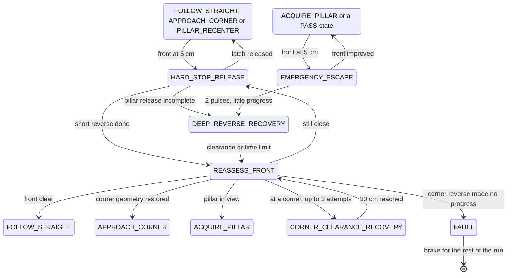
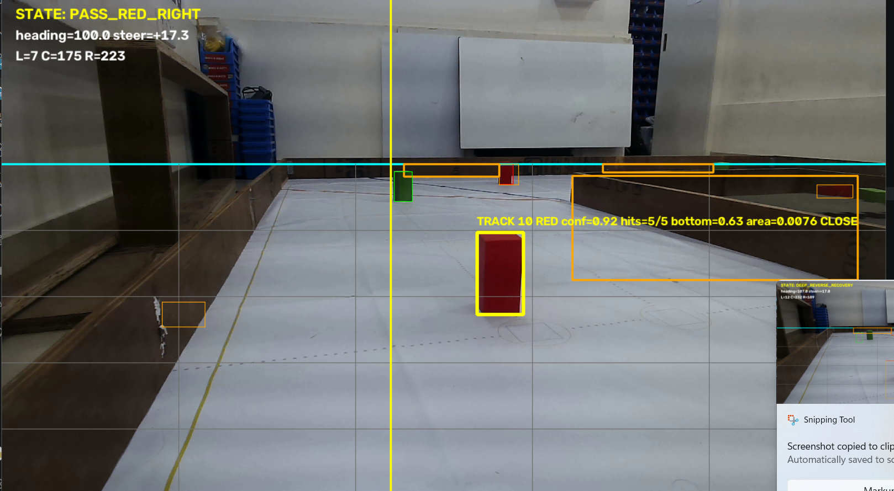
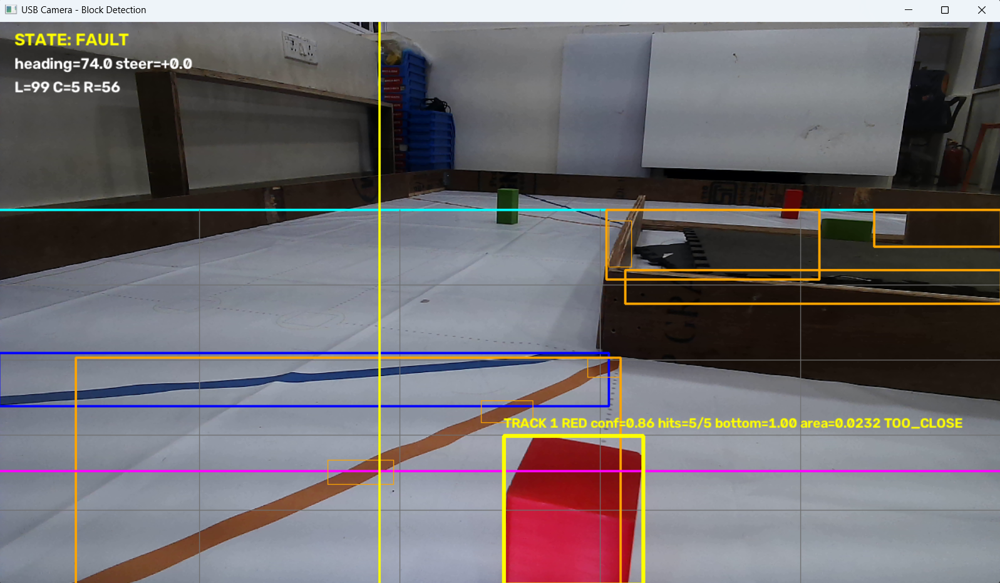

# APAC 2026 software - Obstacle Challenge state machine

**Scope.** How the Obstacle Challenge code in [`main.py`](../src/apac-2026/obstacle-challenge/main.py) works: the control loop and the run (§1–§6), validation (§7), the parking modules (§8), pillar and line detection (§9), staying off the walls (§10) and the Open Challenge firmware (§11). Names in capitals are states; names in `code` are constants, given with their values.

## 1. The control loop

In a loop that sleeps 10 ms between passes (`NAVIGATION_LOOP_SECONDS`), the Raspberry Pi:

1. reads the newest ESP32 telemetry line: heading, the left, centre and right TF-Luna distances, and a validity mask;
2. takes the newest camera frame, masks its sides and runs the pillar and tape-line detector (`UnifiedPillarDetector`, §9);
3. calls the controller (`ObstacleChallengeController.update`), which sends one `speed,direction,steer` command to the ESP32.

The run starts once the start button has been held for 2 s: the ESP32 then sends `OK` and the Pi answers `OK`. The car leaves the parking lot (`ENABLE_PARKING_EXIT = True`), drives three laps and, after the twelfth corner (`COUNTER_MAX = 12`), hands over to a parking module (PARKING_PARALLEL_HANDOFF, §8). Every state change is printed as `[NAV] OLD -> NEW: reason`, and logged when `ENABLE_RUN_CSV_LOGGING = True` (§7).

## 2. The run

The diagrams in this section and in §3 show the transitions the car took in its logged runs of 19–22 September (89 runs, §7); the labels paraphrase the reasons the code prints.

**Leaving the parking lot.**

An anticlockwise start mirrors the lane return (PARKING_EXIT_ANTI_RETURN_1 and _2).

**Three laps.**

- Red pillars are passed on the right and green ones on the left. If the pillar is still in view after CONFIRM_PASSED, the car returns to its pass state.
- At most two pillars are taken on each straight (`MAX_PILLARS_PER_STRAIGHT = 2`); a pillar seen beyond both tape lines within 5 s of a pass (`ALPHA_POSITION_WINDOW_SECONDS`) belongs to the next straight, so the corner is taken first.
- Every driving state brakes and holds while the telemetry is older than 0.30 s (`TELEMETRY_STALE_SECONDS`), a TF-Luna or the heading is invalid, or the camera frame is older than 0.30 s (`CAMERA_STALE_SECONDS`). It resumes in the same state, and the hold does not count against that state's timers.

## 3. Recovery and faults

EMERGENCY_ESCAPE reverses for 0.3 s at speed 80 and resumes the state it interrupted once the front has improved by at least 3 cm (`EMERGENCY_ESCAPE_*`); after 2 pulses without that progress, DEEP_REVERSE_RECOVERY reverses at speed 75 for 0.6 to 0.8 s, aiming for 70 cm of clearance (`DEEP_RECOVERY_*`). HARD_STOP_RELEASE backs off until the front reads 30 cm (`HARD_STOP_RELEASE_CM`).

The code prints a reason with every FAULT: the turn could not reach its target after retries; the ESP32 did not report an applied reverse; the corner-clearance reverse made no reliable progress; both side walls were too close for a corner reverse; in the parking exit, the forward heading alignment timed out (4.5 s), the red approach took more than 4 s, or the timed return did not reach its heading within 5 s.

## 4. Why the states are split this way

| State | Reason |
|---|---|
| PARKING_EXIT_DIRECTION | The lane direction must be known before the first corner. The code takes it from which side wall is nearer: 7 of the last 9 readings must agree, each with left and right at least 15 cm apart (`DIRECTION_MIN_DIFFERENCE_CM`). |
| PARKING_EXIT_ARC_1 to _3 | Three heading arcs, the middle one in reverse, turn the car out of the lot to 35° without touching the parking-lot limitations. |
| PARKING_EXIT_FORWARD_ALIGN, PARKING_EXIT_REVERSE_VIEW | The car straightens to within 8° (at most 4.5 s), then reverses with the camera watching the start section, so the first pillar is seen before the car commits to a side. |
| PARKING_EXIT_SCAN | A pillar may stand just outside the parking lot. If it is on the side the car turns toward (red when driving clockwise, green anticlockwise), a timed pass keeps the car on its correct side; otherwise two heading arcs return the car to its lane. |
| ACQUIRE_PILLAR | One frame of red or green must not steer the car, so a pillar is followed only once 3 of 5 frames confirm it; an unconfirmed candidate is dropped after 1.2 s (`PILLAR_ACQUIRE_TIMEOUT_SECONDS`). |
| CONFIRM_PASSED | The camera loses a pillar before the rear of the car has cleared it, so the car holds its line for 0.25 s (`PILLAR_CLEARANCE_HOLD_SECONDS`). |
| PILLAR_RECENTER | A pass leaves the car angled towards a wall. A timed counter-steer alone would not prove the drift was cancelled, so the car counter-steers until its heading swings back past straight, then centres between the walls (§10). |
| APPROACH_CORNER | Neither a tape line nor a short front distance alone proves a corner. The approach locks after three fresh front readings of 105 cm or less; the turn needs the end wall within 35 cm (`OBSTACLE_CORNER_TRIGGER_CM`), the side the car turns toward open to at least 150 cm and the heading within 12° of the straight, in 3 agreeing samples over 0.25 s. After 3 s without a corner the car resumes the straight. |
| TURN_90 | The target is the straight's heading plus or minus 90°, reached within 5° (`TURN_HEADING_TOLERANCE`). With at least 60 cm of room on the outer side (`CORNER_REVERSE_CLEARANCE_CM`) the turn starts with a reverse arc of up to 0.5 s; if a wall blocks the reverse, the turn continues as a forward arc. |
| POST_TURN_BACKUP, POST_TURN_SCAN_HOLD | After each corner the car reverses for 0.35 s at speed 125 and stops for 0.2 s, "so several stationary frames can prove a nearby pillar" before the next straight. |
| CORNER_CLEARANCE_RECOVERY | A car pressed against the end wall cannot turn. It reverses (speed 150, at most 0.4 s per attempt, up to 3 attempts) until the front has 30 cm of clearance, then re-checks the corner while stopped. |

## 5. Edge cases the code handles

| Situation | What happens |
|---|---|
| Telemetry or camera stale, or a sensor invalid | Brake and hold the current state; resume when fresh. |
| A third pillar on one straight | Ignored until the corner (live view: CORNER NEXT - NO NEW PILLAR). |
| Only one pillar on a straight | 3.6 s after it, the second slot is filled and the corner takes priority (`SECOND_PILLAR_SLOT_TIMEOUT_SECONDS`). |
| Candidate pillar not confirmed | Back to FOLLOW_STRAIGHT after 1.2 s. |
| Pillar beyond the corner seen right after a pass | The corner is taken first (§2). |
| A side wall close during a pillar pass | A correction away from it from 18 cm, with fixed critical and emergency steers at 10 and 6 cm (§10). |
| Front at 5 cm | A short reverse, then a fresh check for a pillar, a corner or a clear front before moving on (§3). |
| Reverse blocked during a turn | The turn continues as a forward arc. |
| Both side walls too close for a corner reverse | FAULT (§3). |
| Twelfth corner | Hand-over to the parking module (§8). |

## 6. Known limits

- The driving direction is locked at the start and does not change during the run.
- The last-resort front trigger (`PYTHON_EMERGENCY_RELEASE_CM = 5`) is inside the TF-Luna's blind zone: its specified range starts at 0.2 m (vendor). Corners are normally handled from 105 cm, so this trigger only acts after a misjudgement.
- The ESP32 always reports `hardStop = 0` ([vehicle §7](apac_2026_vehicle.md)), so the `hard_stop` checks in `main.py` never fire.
- FAULT stops the car for the rest of the run.
- After the twelfth corner `main.py` hands over to the parking module its switches select; it stops with an error if both or neither are on (§8).
- Both parking modules end the entry when the front TF-Luna reads 5 cm or less (`ENTRY_STOP_FRONT_CM = 5`), and `partial_parking.py` also uses limits of 6, 8 and 15 cm (`REVERSE_BLOCK_SEARCH_SIDE_STOP_CM`, `REPOSITION_SIDE_CLEARANCE_CM`, `REPOSITION_FRONT_CLEARANCE_CM`). All are inside the TF-Luna's blind zone.
- In `parallel_parking.py`, FINAL_REVERSE, FINAL_BRAKE and FINAL_FORWARD are defined, but no transition leads into FINAL_REVERSE, so none of the three is reached; PARALLEL_ALIGN ends the parking in COMPLETE.
- The docstrings of `parallel_parking.py` say its detector does not use the blocks' colour; the code (`ParkingGeometryDetector.extract`) keeps only magenta pixels.

## 7. Validation

The metrics that exist, and how the next ones are collected.

- **Run results, 15–22 September** (the car's own logs, [APAC 2026 test logs](apac_2026_test_logs.md)): 27 runs from the parking lot reached the twelfth corner, 22 of them on 18–20 September in a median of 176 s (fastest 154 s); `parallel_parking.py` parked in 15 of 32 attempts on 20 September.
- **Detector, per frame.** The live view shows the tracked pillar's confidence, hits out of 5, bottom position and area band (§9); in the two captured frames of 2026-09-12 the track had 5 of 5 hits at confidence 0.92 and 0.86.
- **APAC bench, 2026-09-21.** Drive and power measurements in [vehicle §3 and §5](apac_2026_vehicle.md): free-running and stall currents, 422 rpm at the rear wheel, 0.89 m/s over 3 m from a standing start, the current of each supply branch.
- **Run logs.** `main.py` can log every run: with `ENABLE_RUN_CSV_LOGGING = True` (committed as `False`) it writes `run_logs/round2_run_<date_time>.csv` beside itself, one row per telemetry sample and one per event, with lap, corner count, pillars this straight, state, heading and target, the three distances, the command sent and applied, the tracked pillar with its band, and the tape depths. Those files give corners completed, pillars passed, recoveries and faults per run; the 260 runs logged from 15 to 23 September are summarised in [APAC 2026 test logs](apac_2026_test_logs.md). For parking, `parallel_parking.py` with `ENABLE_RUN_LOGGING = True` (committed as `False`) writes a CSV and an annotated video per attempt (§8).

## 8. Parking modules

Two files beside `main.py` park the car at the end of the run. After the twelfth corner `main.py` enters PARKING_PARALLEL_HANDOFF and calls the one its switches select (`PARTIAL_PARKING = True` and `PARALLEL_PARKING = False` as committed; exactly one must be on). Each can also run on its own, and each imports `main.py` for the camera, the serial link, telemetry, the live view and the shutdown. At the hand-over `main.py` first registers itself as the module `main` (`sys.modules`), so the parking module reuses the camera, serial port and telemetry already running ("give the standalone parking module the same initialized camera, serial port, telemetry, and safety API"). Constants named in this section are in the parking files.

| File | What it does | Start |
|---|---|---|
| [`parallel_parking.py`](../src/apac-2026/obstacle-challenge/parallel_parking.py) | Parallel parking (`BUILD_ID = "slot-guided-entry-v29"`): finds the two parking-lot limitations with the camera, drives into the gap between them and straightens up | `python parallel_parking.py --direction clockwise --last-pillar auto` |
| [`partial_parking.py`](../src/apac-2026/obstacle-challenge/partial_parking.py) | Direct entry: the same approach and block search, then a drive into the space on a locked heading ("Standalone 90 degree parking" in its help text) | `python partial_parking.py --direction clockwise --last-pillar auto` |

`--direction` is `clockwise` or `anticlockwise`; `--last-pillar` is `auto` (detect a red or green final pillar), `red`, `green` or `none`. Both wait for the start signal as `main.py` does, and end in COMPLETE with the brake held (exit code 0) or in FAULT with a printed reason (exit code 1).

**Which one.** A full parallel park scores 15 points against 7 for a partial or non-parallel one (2026 General Rules, scoring element 1.8.2), and touching a limitation ends the round (rule 9.24.7). As committed, the switches select `partial_parking.py`; parking parallel means setting `PARALLEL_PARKING = True` and `PARTIAL_PARKING = False`. Every `main.py` name the parking modules use exists in the committed `main.py`.

**Camera calibration.** Both files need `parking_camera_calibration.json` beside them. It depends on how the camera is mounted; the team's file, made with the September camera mount, is committed beside them. To make a new one: `python parallel_parking.py --calibrate` shows the camera image, and clicking the four corners of a rectangle on the floor (near-left, near-right, far-right, far-left; 100 × 150 cm unless `--calibration-width-cm` and `--calibration-depth-cm` say otherwise) saves the homography from image to floor. If the file is missing, `parallel_parking.py` starts this calibration itself and exits after saving.

### Finding the space (`parallel_parking.py`)

1. **Colour mask.** Pixels that are magenta in both HSV (`MAGENTA_HSV_LOW` 135, 65, 45 to `MAGENTA_HSV_HIGH` 179, 255, 255) and Lab (a ≥ 145, b ≤ 175). The top 28 % of the image is ignored (`ROI_TOP_FRACTION = 0.28`); one opening and two closings with a 5 × 5 kernel remove specks and fill gaps.
2. **Shape.** Each contour's rotated rectangle must fit a 200 × 20 × 100 mm limitation seen face-on, edge-on or at an angle: aspect 1.15 to 6, rectangularity at least 0.42, magenta fill at least 0.45, width at most 30 % and height 5.5 to 72 % of the image, lower edge below 55 % of the image height and not cut off by the bottom of the image.
3. **Floor position.** The midpoint of the rectangle's two lowest corners goes through the calibration homography, which gives the block's position on the floor in cm.
4. **Two blocks.** A block is confirmed after 3 hits in its last 6 frames (`BOUNDARY_REQUIRED_HITS`, `BOUNDARY_HISTORY`). Block 1 is the best-scoring rectangle on the parking side of the image. Block 2 must not overlap it, and must be 25 to 120 cm from it on the floor, within 55 cm of it sideways and at least 15 cm farther away.
5. **Slot.** The slot is the floor midpoint of the two blocks. It is confident when both blocks are confirmed, neither has been missed for more than 2 frames, they are 25 to 120 cm apart and both have a confidence of at least 0.55. Its bearing from the camera steers the car (`SLOT_BEARING_KP = 2.0`) and is used only within ±30° (`SLOT_MAX_USABLE_BEARING_DEG`).

### States (`parallel_parking.py`)

| State | What the car does | Leaves when |
|---|---|---|
| SEARCH_LAST_PILLAR | Looks for the final pillar with `main.py`'s pillar detector | a pillar is confirmed: PASS_LAST_PILLAR; no pillar and block 1 confirmed: TRACK_OPENING |
| PASS_LAST_PILLAR | Steers past the final pillar | red path: SEARCH_FIRST_BOUNDARY; green path: GREEN_RETURN_STRAIGHT back to the start heading, GREEN_FORWARD_STRAIGHT for 1.0 s, then SEARCH_FIRST_BOUNDARY |
| SEARCH_FIRST_BOUNDARY | Drives at speed 50 on the start heading turned 45° towards the parking side (5° after a green-path pillar). If block 1 is not confirmed within 4 s, a short reverse (0.6 s at speed 60, steer 45) and the search restarts; each retry adds 5° of offset (up to 55°), 0.2 s of search time and a longer, sharper reverse (up to 1.0 s, steer 55; the speed stays 60) | block 1 confirmed: TRACK_OPENING |
| TRACK_OPENING | The same search | block 2 confirmed and the slot confident: ALIGN_VIRTUAL_CUTOUT |
| ALIGN_VIRTUAL_CUTOUT | Speed 50, steering on the slot bearing (at most 25) | 8 consecutive updates with a usable bearing (`ALIGN_CONFIRM_SAMPLES`): ENTER_SPACE; front TF-Luna at 5 cm or less: PARALLEL_ALIGN |
| ENTER_SPACE | Speed 70, steering on the slot bearing (at most 12) | front TF-Luna at 5 cm or less: PARALLEL_ALIGN |
| PARALLEL_ALIGN | Speed 50 at full correction steer (50): reverse strokes of 0.8 s, then forward until the front TF-Luna reads 5 cm | heading within 2° of 0° on 3 consecutive updates: COMPLETE |

The red and green paths swap in an anticlockwise run (`pillar_behavior`). After a green-path pillar, each block search ends in FAULT after 15 s (`GREEN_PARKING_SEARCH_MAX_SECONDS`), and the return to the start heading after 10 s.

### What `partial_parking.py` changes

- **No final pillar.** With `--last-pillar none`, or when no final pillar is confirmed within 3 s, it drives straight for 2 s at speed 80 (NO_PILLAR_STRAIGHT), then searches for block 1 in reverse at speed 50 (REVERSE_BLOCK_SEARCH).
- **Green path.** Clockwise with a green final pillar (anticlockwise with a red one) it steers 45° forward until the centre TF-Luna reads 30 cm, then turns slowly at full lock the other way to a set heading before the block search (GREEN_CW_TURN_RIGHT, GREEN_CW_TURN_LEFT; mirrored as RED_ACW_TURN_LEFT, RED_ACW_TURN_RIGHT).
- **Opening check.** Where the parallel module would start aligning, it requires a visible opening at least 6.5 % of the image wide (`MIN_VISIBLE_ENTRY_GAP_RATIO`) and a slot at least 20 cm ahead with a valid bearing. A narrower opening gets one repositioning (REPOSITION_AWAY, REPOSITION_FORWARD, REPOSITION_RETURN) before a FAULT.
- **Entry.** It locks the entry heading at the current heading plus the slot bearing (at most ±30°) and drives in at speed 70, the parallel module's `ENTRY_SPEED` (ENTER_SPACE). Steering is 2.0 × the heading error plus 0.6 × its integral, which builds only once the slot is closer than 40 cm, plus a smoothed term of at most 8 that centres the opening in the image while the slot is 40 cm or more away; at most 24 in total.
- **Stop.** At a front reading of 5 cm or less, or when the front reading is missing or stale, it brakes (FRONT_SENSOR_HOLD): 3 fresh readings at the stop move on to PARALLEL_ALIGN, and 3 fresh clear readings resume the previous state. PARALLEL_ALIGN works as in the parallel module but counts only fresh telemetry.

### Why it is built this way

Reasons as the code's comments give them.

| Choice | Reason given in the code |
|---|---|
| The TF-Luna sensors are not used while searching for or aligning with the blocks | The blocks' geometry comes from the full camera view; distance matters only once the car is in the space |
| A short camera miss does not brake the car | The brake is not pulsed between camera frames: the selected motion continues until vision recovers, and during alignment the car drives straight and restarts the confirmation |
| Avoiding the final pillar starts on its first sighting, but the pass needs several frames of confirmation | At driving speed a one-frame delay can put the pillar past the useful steering window; a false detection can steer briefly but cannot latch the pass |
| The block search holds a heading offset towards the parking side | So that the blocks enter the camera view; an earlier path turned into the parking area before block 1 was confirmed |
| Reverse strokes in PARALLEL_ALIGN stop after 0.8 s; forward moves stop on the front TF-Luna | So that the car cannot back out of the space |
| The shape limits are broad | A limitation can be seen edge-on, face-on, at an angle or cut off by the image edge |
| One magenta contour never updates both blocks, and a sudden inward jump is taken as the next block | Block 1 leaves the image through its left edge in a clockwise run (the right edge anticlockwise), so a new rectangle further in is block 2, never a new sample of block 1 |
| `partial_parking.py` ignores a pillar cut off by the image edge | Such an object belongs to the next lane, not to the final pillar ahead |

### Failure exits

Every FAULT prints its reason and holds the brake.

- `parallel_parking.py`: after a green-path pillar, the return to the start heading takes more than 10 s, or block 1 or block 2 is not found within 15 s.
- `partial_parking.py`: no valid IMU heading when the entry heading is locked; the opening is still narrower than 6.5 % of the image after one repositioning; the slot is not ahead with a valid bearing; something in front while the final pillar is classified, during the no-pillar straight or during the pillar pass; the pillar pass takes more than 4 s; too little side clearance in the reverse search; too little front or side clearance while repositioning; the opening is lost before the car passes it.

## 9. Pillar and line detection

What `UnifiedPillarDetector` does with each 1280 × 720 frame, and why. Constants are in `main.py`; the two figures at the end show the result on the mat.

1. **Image preparation.** The frame is stretched (`CONTRAST = 3.0`, `BRIGHTNESS = 0`) and gamma-corrected (`GAMMA = 0.7`), then converted to Lab; CLAHE (clip 2.0, 8 × 8 tiles) evens out the lightness channel. Lab keeps lightness apart from the two colour axes, so red (high a) and green (low a) separate with L left open, and a brighter or darker hall mostly moves L ([vehicle §4](apac_2026_vehicle.md)). The venue's thresholds come from one practice round with `lab-calibration.py`.
2. **Side masks.** Before detection a strip at each side of the frame is set to neutral grey (128, outside every Lab range) without moving pixel coordinates (`asymmetric_camera_view`): 16 % of the width on each side on a straight (`CAMERA_SIDE_MASK_FRACTION`). After a corner the two sides are masked separately, depending on the turn direction (`post_turn_view_fractions`, `POST_CORNER_VIEW_SIDE_FRACTION = 0.20`), until the new straight is established: 1.5 s of forward driving, or 12 s.
3. **Colour masks.** One Lab range per colour (`COLOR_RANGES`, as committed): red a at least 184 and b at least 108; green a at most 101; blue a 153 to 186 and b at most 90; orange a at least 130 and b at least 150; L unconstrained. Each mask is opened once and closed twice with a 3 × 3 kernel, and the top third of the image is cleared (`DETECTOR_ROI_TOP_RATIO`): from the 24.8 cm mount that third lies above the tops of the walls out to about 3 m ([vehicle §4](apac_2026_vehicle.md)), so it holds only the hall.
4. **Candidate shapes.** Each contour is tested by size and shape. Pillars (red, green): area at least 0.045 % of the frame and height at least 2.5 % of the frame height; height to width 0.65 to 8 (a 50 × 50 × 100 mm sign is about twice as tall as wide; the range allows partial views and perspective); rectangularity at least 0.35 and solidity at least 0.60, since a pillar is a solid rectangle and tape edges and reflections are not. Tape lines (blue, orange): area at least 0.03 %, height at least 1 %, height to width 0.2 to 10, rectangularity at least 0.25, solidity at least 0.50. Confidence = 0.20 × area + 0.20 × height + 0.25 × rectangularity + 0.35 × solidity, with area and height capped at 5 × the minimum area and 25 % of the frame height; candidates under 0.45 are dropped (`DETECTOR_MIN_CONFIDENCE`).
5. **Tape lines and the corner reference.** The mat's blue and orange lines mark the approach to a corner. They are found in HSV (blue hue 95-135, orange hue 3-22) below the top third, with the same morphology; a line must cover 0.025 % of the frame, span 10 % of its width and be at least twice as wide as tall. The lowest line's mid-height is its depth; when both colours are visible, the deeper of the two is the corner reference (the magenta line in the live view). The code also confirms a corner from the black walls: in HSV (value at most 70), a broad black end wall with an opening on the turn side, confirmed in 3 of the last 4 frames (`BLACK_CORNER_*`).
6. **Which pillar counts.** With the corner reference visible (and not suppressed for 3 s after a turn, `POST_TURN_TAPE_IGNORE_GRACE_SECONDS`), a pillar whose centre is above the reference, farther away than the tape, is ignored when it is entirely above it or sits in an outer column of the 5 × 5 grid: it stands beyond the corner or in a side lane (IGNORE CORNER in the live view). Two rules keep the car from dropping the obstacle in front of it: the track the controller is already passing keeps priority even when tape moves in front of it (FRONT PRIORITY), and when a larger, lower interior pillar and a smaller outer pillar are both beyond the reference, the interior pillar stays actionable if it is 1.25 × larger (`CORNER_FOREGROUND_AREA_ADVANTAGE`). A small ignored pillar never suppresses a valid foreground pillar.
7. **Tracking.** One pillar is tracked at a time. A new track starts on the best candidate by 0.55 × bottom + 0.35 × confidence + 0.10 × area: the lowest in the image is the nearest. Each frame the track is matched to a same-colour candidate by centre distance (at most 0.25 of the frame) or overlap (IoU at least 0.05), and its position is smoothed (0.65 new, 0.35 old). A track is confirmed after 3 hits in its last 5 frames (`DETECTOR_CONFIRMATION_HITS`, `DETECTOR_TRACK_HISTORY`); an unconfirmed track is dropped after 2 misses (`DETECTOR_UNCONFIRMED_MISSES`); a confirmed track stays locked until the controller records the pass, so a brief occlusion cannot switch the target. Confidence is 0.75 × the detection's confidence + 0.25 × hits/5, and decays by 10 % per missed frame.
8. **Two pillars per straight**. At most two pillars are taken on each straight (`MAX_PILLARS_PER_STRAIGHT = 2`); once both are passed, no new pillar is taken until the corner (live view: CORNER NEXT - NO NEW PILLAR). If no second pillar has come 3.6 s after the first, slot 2 is filled and the corner takes priority (`SECOND_PILLAR_SLOT_TIMEOUT_SECONDS`). One high track in the next lane is deferred rather than its whole colour suppressed, and right after a turn nearby pillars take priority (`defer_background_candidate`). A wide, low rectangle, at least twice as wide as tall, is treated as a parking-lot limitation, not a pillar; in laps 1 and 2 the car steers gently around it (speed 60, steering 15).
9. **Range and control.** The pillar's distance band comes from its area: far under 3,200 px×px, near under 7,000, close under 20,000, otherwise too close; the 1280 × 720 breakpoints are kept as ratios of the frame (`PILLAR_AREA_NEAR_RATIO`, `PILLAR_AREA_CLOSE_RATIO`, `PILLAR_AREA_TOO_CLOSE_RATIO`). Each band selects a speed, gain and steering limit (`PILLAR_DISTANCE_PROFILES`; far: speed 100, gain 0.70, 3 to 12 of steer; too close: speed 80, gain 1.50, 38 to 52). The controller steers the pillar to a target column, red to 38 % of the width so the car passes on its right and green to 62 % so it passes on its left (`PILLAR_RED_TARGET_X`, `PILLAR_GREEN_TARGET_X`), with gain 200 (`PILLAR_LATERAL_KP`), at most 40 of correction and smoothing 0.65.

**The live view** (`annotate`): the cyan line is the top of the search area; the grey grid is the 5 × 5 columns and rows; blue and orange boxes are tape lines; the magenta line is the corner reference; thin boxes are candidates; a magenta box is a pillar ignored as beyond the corner (`IGNORE CORNER Cn`, n = grid column); a yellow box marks the pillar being passed (`FRONT PRIORITY`); the tracked pillar's box is yellow once confirmed and cyan before, labelled `TRACK id COLOUR conf hits/5 bottom area BAND`, with a vertical line at its target column; the text lines give the state, heading and steer, and the three TF-Luna readings in cm. The live view also shows PILLAR SLOTS n/2, CORNER NEXT - NO NEW PILLAR, SLOT 2 TIMEOUT IN n s, BLACK CORNER and VIEW MASK L=n% R=n%.

Two frames from testing on 12 September.

Passing a red pillar: state PASS_RED_RIGHT, steer +17.3 at heading 100.0; TF-Luna L 7, C 175, R 223 cm; track 18, red, confidence 0.92, 5 of 5 hits, bottom 0.63, area 0.0076, band close; orange tape boxes ahead and the red target column drawn.

A run that ended in FAULT: a red pillar 5 cm from the centre TF-Luna (L 99, C 5, R 56 cm), track 1 at confidence 0.86, bottom 1.00, area 0.0232, band too close; both tape lines are visible and the magenta corner reference is drawn. The fault reason is printed to the terminal, not to the view, and was not captured.

## 10. Staying off the walls

Four mechanisms keep the car in the middle of its lane; with them the side rollers were no longer needed ([vehicle §7](apac_2026_vehicle.md)).

- **PILLAR_RECENTER**, after every pillar pass, counter-steers 22° against the pass for 0.18 to 0.45 s and moves on once the heading has swung back past straight, "proof it actually cancelled the drift, not just a timer"; it then settles onto the lane centre from the heading and both side TF-Lunas (both walls 8 to 110 cm away, heading within 10°, gain 0.5, at most 18 of steer, 3 confirmations).
- **A wall guard during pillar passes**: a side wall closer than 18 cm (`PILLAR_WALL_WARNING_CM`) adds a correction away from it that grows to 35 at 6 cm; at 10 cm a fixed critical steer takes over, and at 6 cm an emergency steer at speed 65.
- **Recentering after corners**: a side-distance correction (`ROUND2_RECENTER_*`: gain 0.45, at most 14, heading within 8°).
- **CORNER_CLEARANCE_RECOVERY** (§4), with the side-clearance check before a corner reverse (`TURN_SIDE_CLEARANCE_CM = 20`).

## 11. Open Challenge firmware

[`open-challenge/open-challenge.ino`](../src/apac-2026/open-challenge/open-challenge.ino) drives the Open Challenge on the ESP32 alone, without the Raspberry Pi or the camera. It uses the same pins, I2C multiplexer channels and sensors as the Obstacle firmware; the servo centre is `SERVO_CENTER = 106` here and 85 in the Obstacle firmware. Constants are in the file.

1. **Start and direction.** After the start button (GPIO32), the car drives at speed 190 (`DETECTION_SPEED`) until one side reading opens beyond 100 cm on 3 samples (`DIRECTION_DETECTION_DISTANCE_CM`, `DIRECTION_CONFIRMATION_SAMPLES`); that side sets clockwise or anticlockwise, keeping the original priority for the right side.
2. **Wall following.** At speed 190 (`FOLLOW_SPEED`) the car holds its heading (gains 0.55 and 0.08, `HEADING_KP`, `HEADING_KD`) and keeps 30 cm from the followed wall (`TARGET_LEFT_DISTANCE_CM`, `TARGET_RIGHT_DISTANCE_CM`; gain 0.50, at most 12), with at most 25 of steering in total.
3. **Corners.** When the followed side opens beyond 75 cm on the left or 50 cm on the right on 3 samples, the car turns 90° on the BNO055 heading at speed 160 (gains 0.75 and 0.06, at most 35 of steering) until the error is under 4°. It then drives at speed 210 for a minimum time (500 ms clockwise, none anticlockwise) and reacquires the wall below 50 cm on 3 samples.
4. **Finish.** After twelve turns (`TOTAL_TURNS`) it holds the heading of the last turn and brakes when the centre TF-Luna reads 150 cm or less (`FINAL_CENTER_DISTANCE_CM`); the electrical brake then stays latched.

The control loop runs every 10 ms (`CONTROL_PERIOD_US`), and servo pulses come from a dedicated task on the other core (`servoPulseTask`, 20 ms frames).
