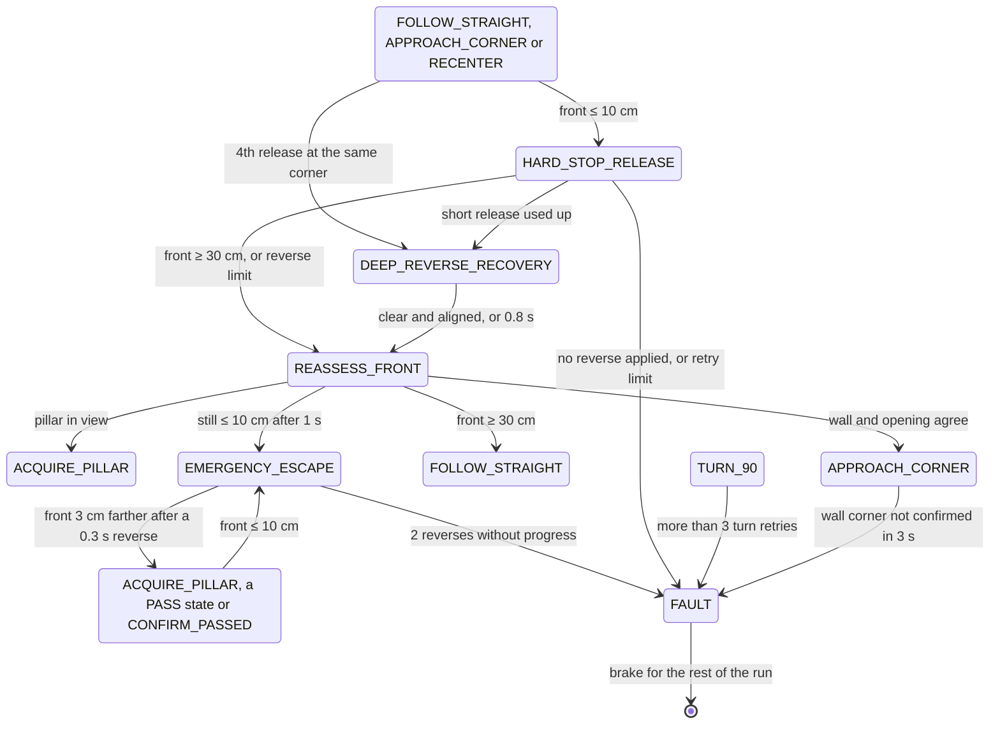

# APAC 2026 software — Obstacle Challenge state machine

**Scope.** How [`src/apac-2026/obstacle-challenge/main.py`](../src/apac-2026/obstacle-challenge/main.py) drives the Obstacle Challenge, as committed in v0.4.0. Names in capitals are the controller's states; names in `code` are constants in `main.py`, given with their values. The Nationals software is in [3 — Software](3_software.md) and the vehicle in [APAC 2026 vehicle](apac_2026_vehicle.md). The two parking modules added on 2026-09-23 run on their own and are in §8; the constants named there are in their own files.

## 1. The control loop

In a loop that sleeps 10 ms between passes (`NAVIGATION_LOOP_SECONDS`), the Raspberry Pi:

1. reads the newest ESP32 telemetry line: heading, the left, centre and right TF-Luna distances, and a validity mask;
2. takes the newest camera frame and runs the pillar and tape-line detector (`UnifiedPillarDetector`);
3. calls the controller (`ObstacleChallengeController.update`), which sends one `speed,direction,steer` command to the ESP32.

The run starts once the start button has been held for 2 s: the ESP32 then sends `OK` and the Pi answers `OK`. It ends in COMPLETE after 12 corners (`COUNTER_MAX`), that is three laps. Parking exit is on (`ENABLE_PARKING_EXIT = True`); parking at the end is off (`ENABLE_PARKING_IN = False`). Every state change is printed as `[NAV] OLD -> NEW: reason`.

## 2. The run

- Red pillars are passed on the right and green ones on the left.
- From any pillar state, a pillar seen beyond both tape lines within 5 s of a pass (`ALPHA_POSITION_WINDOW_SECONDS`) belongs to the next straight, so the car goes to APPROACH_CORNER and takes the corner first.
- Every driving state brakes and holds while the telemetry is older than 0.30 s (`TELEMETRY_STALE_SECONDS`), a TF-Luna or the heading is invalid, or the camera frame is older than 0.30 s (`CAMERA_STALE_SECONDS`). It resumes in the same state, and the hold does not count against that state's timers.

## 3. Recovery and faults

EMERGENCY_ESCAPE resumes whichever state it interrupted. The parking-exit states also go to FAULT when a timed step overruns (4 s to reach the first red pillar, 5 s to reach the lane heading).

## 4. Why the states are split this way

| State | Reason |
|---|---|
| PARKING_EXIT_DIRECTION | The lane direction must be known before the first corner. The code takes it from which side wall is nearer: 7 of the last 9 readings must agree, each with left and right at least 15 cm apart (`DIRECTION_MIN_DIFFERENCE_CM`). |
| PARKING_EXIT_SCAN | A pillar may stand just outside the parking lot. If it is on the side the car turns toward (red when driving clockwise, green anticlockwise), a timed pass keeps the car on its correct side; otherwise two heading arcs return the car to its lane. |
| ACQUIRE_PILLAR | One frame of red or green must not steer the car, so a pillar is followed only once 3 of 5 frames confirm it. |
| CONFIRM_PASSED | The camera loses a pillar before the rear of the car has cleared it, so the car holds its line for 0.25 s (`PILLAR_CLEARANCE_HOLD_SECONDS`). |
| APPROACH_CORNER | Neither a tape line nor a short front distance alone proves a corner. A turn needs the end wall within 38 cm (`CORNER_TRIGGER_CM`), the side the car turns toward open to at least 150 cm (`OBSTACLE_CORNER_SIDE_OPEN_CM`) and the heading within 8° of the straight, in 5 agreeing samples over at least 0.30 s. |
| TURN_90 | The target is the straight's heading plus or minus 90°, reached within 5° (`TURN_HEADING_TOLERANCE`). When the outer side has at least 60 cm of room (`CORNER_REVERSE_CLEARANCE_CM`), the turn starts with a reverse arc of up to 0.8 s; otherwise it is driven forward. |
| POST_TURN_BACKUP | After each corner the car reverses for 2.8 s (`POST_TURN_BACKUP_SECONDS`) so that the next straight and its pillars fit in the camera's view. |

## 5. Edge cases the code handles

| Situation | What happens |
|---|---|
| Telemetry or camera stale, or a sensor invalid | Brake and hold the current state; resume when fresh. |
| The same pillar seen again just after a pass | Ignored for 0.6 s (`PILLAR_REACQUIRE_COOLDOWN_SECONDS`). |
| Candidate pillar not confirmed | Back to FOLLOW_STRAIGHT after 0.8 s (`PILLAR_ACQUIRE_TIMEOUT_SECONDS`). |
| Pillar ahead during a corner approach | The corner is paused, the pillar is passed, then the corner approach resumes. |
| Pillar beyond the corner seen right after a pass | The corner is taken first (§2). |
| Front within 10 cm | A short reverse, then a fresh check for a pillar, a corner or a clear front before moving on (§3). |
| Repeated releases at one corner | After the third, a longer reverse at speed 55 for up to 0.8 s, aiming for 70 cm of clearance. |
| Turn not finished in 5 s | Retry with the other turn mode (forward or reverse), up to 3 retries. |
| 12th corner | COMPLETE: the car brakes and stays stopped. |

## 6. Known limits

- The driving direction is locked at the start and does not change during the run.
- The last-resort front trigger (`PYTHON_EMERGENCY_RELEASE_CM = 10`) is inside the TF-Luna's blind zone: its specified range starts at 0.2 m (vendor). Corners are normally handled from 45 cm, so this trigger only acts after a misjudgement.
- Since the firmware stop was removed on 2026-09-10, the ESP32 always reports `hardStop = 0`, so the `hard_stop` checks in `main.py` never fire; some comments in `main.py` still describe an ESP32 stop at 18 cm.
- With parking at the end off, PARKING_ENTRY_SEARCH and the PARKING_IN_ states are never reached. No transition leads into the PARKING_EXIT_CW_RED_ and PARKING_EXIT_ANTI_GREEN_ states.
- FAULT stops the car for the rest of the run.
- `main.py` as committed does not call the parking modules (§8). The docstring of `partial_parking.py` says `main.py` "can hand control to partial_parking_main after corner 12"; no such call is in the committed `main.py`.
- Both parking modules end the entry when the front TF-Luna reads 5 cm or less (`ENTRY_STOP_FRONT_CM = 5`), and `partial_parking.py` also uses limits of 6, 8 and 15 cm (`REVERSE_BLOCK_SEARCH_SIDE_STOP_CM`, `REPOSITION_SIDE_CLEARANCE_CM`, `REPOSITION_FRONT_CLEARANCE_CM`). All are inside the TF-Luna's blind zone: its specified range starts at 0.2 m (vendor).
- In `parallel_parking.py`, FINAL_REVERSE, FINAL_BRAKE and FINAL_FORWARD are defined, but no transition leads into FINAL_REVERSE, so none of the three is reached; PARALLEL_ALIGN ends the parking in COMPLETE.
- The docstrings of `parallel_parking.py` say its detector does not use the blocks' colour; the code (`ParkingGeometryDetector.extract`) keeps only magenta pixels.

## 7. Validation

Not in the repository yet: run logs. A run started as `python main.py 2>&1 | tee run_N.log` records every transition with its reason, which gives corners completed, pillars passed, recoveries and faults per run.

Parking: with `ENABLE_RUN_LOGGING = True` (committed as `False`), `parallel_parking.py` writes `run_logs/parking_run_<time>.csv`, one row per frame (state, heading, the three distances, the command, both blocks' floor positions and confidences, and the slot's position, heading and bearing), and an annotated video at 15 frames per second. `partial_parking.py` prints a status line every 0.5 s; run it as `python partial_parking.py --direction clockwise 2>&1 | tee park_N.log`. Every parking run ends in COMPLETE or in FAULT with its reason, so attempts, successes and fault reasons can be counted.

## 8. Parking modules

Two files beside `main.py`, added on 2026-09-23, park the car at the end of the run. `main.py` as committed does not call them (`ENABLE_PARKING_IN = False`, §6): each runs on its own and imports `main.py` for the camera, the serial link, telemetry, the live view and the shutdown. Constants named in this section are in the parking files.

| File | What it does | Start |
|---|---|---|
| [`parallel_parking.py`](../src/apac-2026/obstacle-challenge/parallel_parking.py) | Parallel parking (`BUILD_ID = "slot-guided-entry-v29"`): finds the two parking-lot limitations with the camera, drives into the gap between them and straightens up | `python parallel_parking.py --direction clockwise --last-pillar auto` |
| [`partial_parking.py`](../src/apac-2026/obstacle-challenge/partial_parking.py) | Direct entry: the same approach and block search, then a drive into the space on a locked heading ("Standalone 90 degree parking" in its help text) | `python partial_parking.py --direction clockwise --last-pillar auto` |

`--direction` is `clockwise` or `anticlockwise`; `--last-pillar` is `auto` (detect a red or green final pillar), `red`, `green` or `none`. Both wait for the start signal as `main.py` does, and end in COMPLETE with the brake held (exit code 0) or in FAULT with a printed reason (exit code 1).

**Camera calibration.** Both files need `parking_camera_calibration.json` beside them. It depends on how the camera is mounted, so it is made on the vehicle and is not in the repository: `python parallel_parking.py --calibrate` shows the camera image, and clicking the four corners of a rectangle on the floor (near-left, near-right, far-right, far-left; 100 × 150 cm unless `--calibration-width-cm` and `--calibration-depth-cm` say otherwise) saves the homography from image to floor. If the file is missing, `parallel_parking.py` starts this calibration itself and exits after saving.

### Finding the space (`parallel_parking.py`)

1. **Colour mask.** Pixels that are magenta in both HSV (`MAGENTA_HSV_LOW` 135, 65, 45 to `MAGENTA_HSV_HIGH` 179, 255, 255) and Lab (a ≥ 145, b ≤ 175). The top 28 % of the image is ignored (`ROI_TOP_FRACTION = 0.28`); one opening and two closings with a 5 × 5 kernel remove specks and fill gaps.
2. **Shape.** Each contour's rotated rectangle must fit a 200 × 20 × 100 mm limitation seen face-on, edge-on or at an angle: aspect 1.15 to 6, rectangularity at least 0.42, magenta fill at least 0.45, width at most 30 % and height 5.5 to 72 % of the image, lower edge below 55 % of the image height and not cut off by the bottom of the image.
3. **Floor position.** The midpoint of the rectangle's two lowest corners goes through the calibration homography, which gives the block's position on the floor in cm.
4. **Two blocks.** A block is confirmed after 3 hits in its last 6 frames (`BOUNDARY_REQUIRED_HITS`, `BOUNDARY_HISTORY`). Block 1 is the best-scoring rectangle on the parking side of the image. Block 2 must not overlap it, and must be 25 to 120 cm from it on the floor, within 55 cm of it sideways and at least 15 cm farther away.
5. **Slot.** The slot is the floor midpoint of the two blocks. It is confident when both blocks are confirmed, neither has been missed for more than 2 frames, they are 25 to 120 cm apart and both have a confidence of at least 0.55. Its bearing from the camera steers the car (`SLOT_BEARING_KP = 2.0`) and is used only within ±30° (`SLOT_MAX_USABLE_BEARING_DEG`).

### States (`parallel_parking.py`)

| State | What the car does | Leaves when |
|---|---|---|
| SEARCH_LAST_PILLAR | Looks for the final pillar with `main.py`'s pillar detector | a pillar is confirmed: PASS_LAST_PILLAR; no pillar and block 1 confirmed: TRACK_OPENING |
| PASS_LAST_PILLAR | Steers past the final pillar | red path: SEARCH_FIRST_BOUNDARY; green path: GREEN_RETURN_STRAIGHT back to the start heading, GREEN_FORWARD_STRAIGHT for 1.0 s, then SEARCH_FIRST_BOUNDARY |
| SEARCH_FIRST_BOUNDARY | Drives at speed 40 on the start heading turned 45° towards the parking side (5° after a green-path pillar). If block 1 is not confirmed within 4 s, a short reverse (0.6 s at speed 55, steer 35) and the search restarts; each retry adds 5° of offset (up to 55°), 0.2 s of search time and a longer, faster, sharper reverse (up to 1.0 s, speed 75, steer 55) | block 1 confirmed: TRACK_OPENING |
| TRACK_OPENING | The same search | block 2 confirmed and the slot confident: ALIGN_VIRTUAL_CUTOUT |
| ALIGN_VIRTUAL_CUTOUT | Speed 40, steering on the slot bearing (at most 25) | 8 consecutive updates with a usable bearing (`ALIGN_CONFIRM_SAMPLES`): ENTER_SPACE; front TF-Luna at 5 cm or less: PARALLEL_ALIGN |
| ENTER_SPACE | Speed 40, steering on the slot bearing (at most 12) | front TF-Luna at 5 cm or less: PARALLEL_ALIGN |
| PARALLEL_ALIGN | Speed 35 at full correction steer (45): reverse strokes of 0.8 s, then forward until the front TF-Luna reads 5 cm | heading within 2° of 0° on 3 consecutive updates: COMPLETE |

The red and green paths swap in an anticlockwise run (`pillar_behavior`). After a green-path pillar, each block search ends in FAULT after 15 s (`GREEN_PARKING_SEARCH_MAX_SECONDS`), and the return to the start heading after 10 s.

### What `partial_parking.py` changes

- **No final pillar.** With `--last-pillar none`, or when no final pillar is confirmed within 3 s, it drives straight for 2 s at speed 80 (NO_PILLAR_STRAIGHT), then searches for block 1 in reverse at speed 50 (REVERSE_BLOCK_SEARCH).
- **Green path.** Clockwise with a green final pillar (anticlockwise with a red one) it steers 45° forward until the centre TF-Luna reads 30 cm, then turns slowly at full lock the other way to a set heading before the block search (GREEN_CW_TURN_RIGHT, GREEN_CW_TURN_LEFT; mirrored as RED_ACW_TURN_LEFT, RED_ACW_TURN_RIGHT).
- **Opening check.** Where the parallel module would start aligning, it requires a visible opening at least 6.5 % of the image wide (`MIN_VISIBLE_ENTRY_GAP_RATIO`) and a slot at least 20 cm ahead with a valid bearing. A narrower opening gets one repositioning (REPOSITION_AWAY, REPOSITION_FORWARD, REPOSITION_RETURN) before a FAULT.
- **Entry.** It locks the entry heading at the current heading plus the slot bearing (at most ±30°) and drives in at speed 40 (ENTER_SPACE). Steering is 2.0 × the heading error plus 0.6 × its integral, which builds only once the slot is closer than 40 cm, plus a smoothed term of at most 8 that centres the opening in the image while the slot is 40 cm or more away; at most 24 in total.
- **Stop.** At a front reading of 5 cm or less, or when the front reading is missing or stale, it brakes (FRONT_SENSOR_HOLD): 3 fresh readings at the stop move on to PARALLEL_ALIGN, and 3 fresh clear readings resume the previous state. PARALLEL_ALIGN works as in the parallel module but counts only fresh telemetry.

### Why it is built this way

Reasons as the code's comments give them.

| Choice | Reason given in the code |
|---|---|
| The TF-Luna sensors are not used while searching for or aligning with the blocks | The blocks' geometry comes from the full camera view; distance matters only once the car is in the space |
| A short camera miss does not brake the car | The brake is not pulsed between camera frames: the selected motion continues until vision recovers, and during alignment the car drives straight and restarts the confirmation |
| Avoiding the final pillar starts on its first sighting, but the pass needs several frames of confirmation | At driving speed a one-frame delay can put the pillar past the useful steering window; a false detection can steer briefly but cannot latch the pass |
| The block search holds a heading offset towards the parking side | So that the blocks enter the camera view; an earlier path turned into the parking area before block 1 was confirmed |
| Reverse strokes in PARALLEL_ALIGN stop after 0.8 s; forward moves stop on the front TF-Luna | So that the car cannot back out of the space |
| The shape limits are broad | A limitation can be seen edge-on, face-on, at an angle or cut off by the image edge |
| One magenta contour never updates both blocks, and a sudden inward jump is taken as the next block | Block 1 leaves the image through its left edge in a clockwise run (the right edge anticlockwise), so a new rectangle further in is block 2, never a new sample of block 1 |
| `partial_parking.py` ignores a pillar cut off by the image edge | Such an object belongs to the next lane, not to the final pillar ahead |

### Failure exits

Every FAULT prints its reason and holds the brake.

- `parallel_parking.py`: after a green-path pillar, the return to the start heading takes more than 10 s, or block 1 or block 2 is not found within 15 s.
- `partial_parking.py`: no valid IMU heading when the entry heading is locked; the opening is still narrower than 6.5 % of the image after one repositioning; the slot is not ahead with a valid bearing; something in front while the final pillar is classified, during the no-pillar straight or during the pillar pass; the pillar pass takes more than 4 s; too little side clearance in the reverse search; too little front or side clearance while repositioning; the opening is lost before the car passes it.
