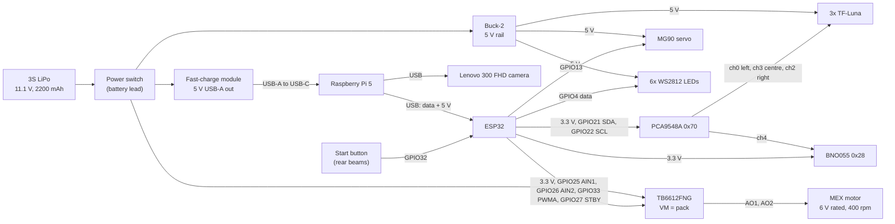

# APAC 2026 wiring — power and signals (as built, 2026-09-20)

Current diagram for the September rebuild. It replaces `circuit_diagram_complete_2026-08-11.jpg` (the Nationals vehicle) and adds the WS2812 LEDs on GPIO4, the power switch on the battery lead, the start button on GPIO32 and the MEX drive motor. Pins come from the Nationals firmware and the 2026-09-20 wiring draft and will be re-checked against the APAC firmware when it is committed. All grounds are common (not drawn).

Loads on each rail: the fast-charge module feeds the Pi 5, which powers the camera and the ESP32 over USB (600 mA total without USB-PD, see [APAC 2026 vehicle §6](../docs/apac_2026_vehicle.md)); Buck-2 feeds the three TF-Lunas, the servo and the LEDs (up to 0.36 A for the LEDs at full white); the TB6612FNG takes the motor current straight from the pack.
